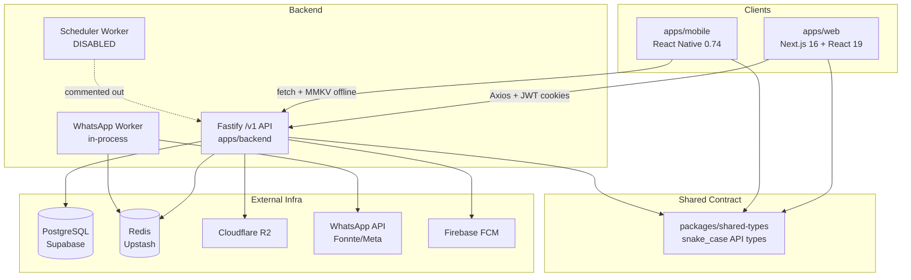
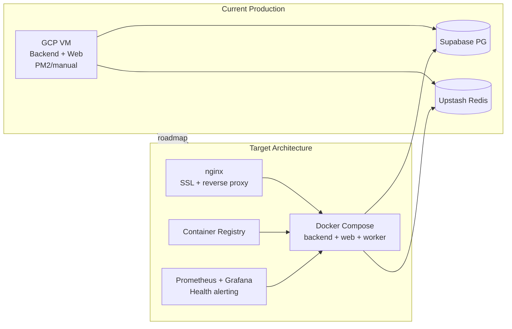

# Analisis Menyeluruh: Arsitektur Kodebase & Infrastruktur Lazisnu

## Ringkasan Eksekutif

Lazisnu adalah monorepo pnpm dengan **3 aplikasi** (`apps/backend`, `apps/web`, `apps/mobile`) dan **1 package kontrak** (`packages/shared-types`). Arsitektur aplikasi sudah matang untuk domain inti (koleksi infaq, offline sync, audit trail, notifikasi WA), tetapi **infrastruktur operasional masih early-stage**: tidak ada containerization, CI tidak menjalankan test, scheduler cron dinonaktifkan, dan observability belum aktif penuh.

Dokumen terkait yang sudah ada: [`docs/infrastructure-analysis.md`](docs/infrastructure-analysis.md) — analisis ini memvalidasi dan memperdalam temuan tersebut dengan pemetaan arsitektur aplikasi.

---

## 1. Identitas Proyek & Tiga Pilar Bisnis

Sumber: [`.agents/rules/00-project-overview.md`](.agents/rules/00-project-overview.md)

| Pilar | Implementasi di Kode |
|-------|---------------------|
| **Immutable audit trail** | `collections` INSERT-only + PostgreSQL RULE di [`apps/backend/src/database/migrations/immutable-rule.sql`](apps/backend/src/database/migrations/immutable-rule.sql); koreksi via `submit_sequence` baru |
| **WhatsApp sebagai verifikasi eksternal** | Setiap submit koleksi → BullMQ queue → [`whatsapp.worker.ts`](apps/backend/src/workers/whatsapp.worker.ts) → Fonnte/Meta API |
| **Offline-first mobile** | MMKV queue → batch sync ke [`mobileSyncService.ts`](apps/backend/src/services/mobileSyncService.ts) |

**Peran pengguna:**

| Role | Platform | Scope Data |
|------|----------|------------|
| `ADMIN_KECAMATAN` | Web | Semua kecamatan/ranting |
| `ADMIN_RANTING` | Web | Ranting sendiri |
| `BENDAHARA` | Web | Read-only laporan + operasional |
| `PETUGAS` | Mobile | Tugas & koleksi milik sendiri |

---

## 2. Struktur Monorepo



**Build order wajib:** `shared-types` → `backend` / `web` (script [`package.json`](package.json): `build:shared` → `build:all`)

**Konvensi API:** prefix `/v1`, payload snake_case, response wrapper `ApiResponse<T>` dari shared-types.

---

## 3. Alur Data End-to-End

### 3a. Submit Koleksi (Happy Path — Mobile)

```txt
Petugas tap tugas → Scan QR
  → apps/mobile/screens/CollectionScreen.tsx
  → useCollectionStore.submitCollection()
  → offline/queue.ts (MMKV enqueue, schema v2)
  → Optimistic UI update (tasks, dashboard)
  → sync.ts autoSync() jika online
  → POST /v1/mobile/collections/batch
  → routes/mobile/sync.ts
  → mobileSyncService.processSyncItem()
     1. Idempotency check via offline_id
     2. validateAssignmentForSubmit + submitCollection (transaction)
     3. Queue WhatsApp notification (failure tidak rollback koleksi)
  → PostgreSQL collections INSERT
  → BullMQ whatsapp-notifications
  → whatsapp.worker → notifications table + WA API
  → BatchSyncResponse → mobile dequeue / retry / failed-permanent
```

**Batas validasi:** QR valid, assignment aktif, periode belum disubmit, nominal > 0. Offline batch hanya mendukung `CASH`.

### 3b. Auth Flow

```txt
Web: login page → /api/auth/login (Next.js Route Handler)
  → proxy POST /v1/auth/login
  → bcrypt verify + Redis lockout (10 failures)
  → JWT access (15m) + refresh (7d, jti UUID)
  → cookies: lazisnu_token + lazisnu_refresh_token (HttpOnly)
  → middleware.ts role-based route guard

Mobile: OTP via WA
  → POST /v1/auth/request-otp → POST /v1/auth/verify-otp
  → tokens di encrypted MMKV
  → apiRequest() dengan 401 → refresh → retry subscriber pattern
```

**Session registry:** Redis `refresh:{jti}` + PostgreSQL `user_sessions` ([`sessionService.ts`](apps/backend/src/services/sessionService.ts)).

### 3c. Admin Dashboard

```txt
Web dashboard page → lib/api.ts (Axios)
  → /v1/admin/* atau /v1/bendahara/*
  → authenticate + authorize(role) middleware
  → service layer (dashboardService, collectionReportService, officerService, dll)
  → Drizzle queries dengan scope district/branch
```

---

## 4. Arsitektur Backend (Detail)

**Entry:** [`apps/backend/src/index.ts`](apps/backend/src/index.ts) — Fastify listen, WhatsApp worker aktif, **scheduler dinonaktifkan** (baris 6, 20-22, 33 dikomen).

**Middleware stack** ([`app.ts`](apps/backend/src/app.ts)):
- Correlation ID → CORS → JWT → Rate limit (100/min) → Audit logger → Error handler
- Swagger `/docs` hanya non-production

**Route map:**

| Prefix | Auth | Fungsi |
|--------|------|--------|
| `/v1/auth` | Public | Login, OTP, refresh, sessions |
| `/v1/mobile` | JWT | Tasks, collections, sync, profile |
| `/v1/admin` | JWT + RBAC | CRUD master data, assignments, reports, WA monitor |
| `/v1/bendahara` | JWT + role | Laporan read-only |
| `/v1/scheduler` | `x-internal-api-key` | Manual trigger generate tasks & summaries |
| `/health/live`, `/health/ready` | Public | Liveness + readiness (DB + Redis ping) |
| `/metrics` | Public | Prometheus (501 jika `prom-client` tidak terinstall) |

**Workers:**

| Worker | Status | Queue | Catatan |
|--------|--------|-------|---------|
| WhatsApp | **Aktif** (in-process) | `whatsapp-notifications` | Rate 2 msg/s, dedup `jobId: collection-{id}` |
| Scheduler | **Nonaktif** | `lazisnu-scheduler` | Cron bulanan + DLQ cleanup; alternatif: HTTP `/v1/scheduler/*` |

---

## 5. Model Data & Migrasi

**Schema source of truth:** [`apps/backend/src/database/schema.ts`](apps/backend/src/database/schema.ts)

**Hierarki entitas:**
```
districts → branches → dukuhs
              ├── users → officers (1:1)
              ├── cans
              └── assignments (can ↔ officer, per period)
                    └── collections (immutable, versioned)
                          └── notifications (WA log)
```

**Tabel kunci tambahan:** `user_sessions`, `activity_logs`, `collection_summaries`, `sync_queues` (schema ada, **belum dipakai di kode aplikasi**).

**Strategi migrasi — hybrid & berisiko:**

| Aspek | State | Risiko |
|-------|-------|--------|
| Journal resmi | 3 file (`0000`–`0002`) | OK untuk baseline |
| SQL legacy | 5+ file di luar journal (`0001_rename_nominal.sql`, dll) | Drift dev/prod |
| Dev workflow | `drizzle-kit push` via `db:push` script | Schema tanpa migration file |
| Production | Manual SQL review | Human error, tidak otomatis di deploy |
| Immutable rule | PostgreSQL RULE terpisah | Harus diapply manual |

**Connection pool:** `max: 10` di [`database.ts`](apps/backend/src/config/database.ts) — cukup untuk ~100 petugas saat ini.

---

## 6. Mobile Offline Architecture

| Komponen | File | Perilaku |
|----------|------|----------|
| Storage | `offline/mmkv.ts` | Encrypted MMKV |
| Queue | `offline/queue.ts` | Per-officer keys, schema v2, max 3 retries |
| Sync | `offline/sync.ts` | NetInfo listener, module lock, exponential backoff |
| State | `stores/useSyncStore.ts` | Pending/failed counts, trigger sync |
| API | `services/api.ts` | Hardcode prod URL `https://api.lazisnu.app/v1` |

**Klasifikasi error sync:** validation → failed-permanent; server error → retry; `ALREADY_SYNCED` → dequeue.

---

## 7. Web Dashboard Architecture

- **Framework:** Next.js 16 App Router, React 19, Tailwind v4, SWR, Zustand
- **Auth proxy:** Route handlers di `app/api/auth/` — backend tidak expose refresh token ke client JS
- **RBAC:** [`middleware.ts`](apps/web/src/middleware.ts) decode JWT role → redirect per route
- **Halaman utama:** overview, assignments, cans, master, users/[id], reports, resubmit, audit-log, wa-monitor

---

## 8. Shared Types Contract

[`packages/shared-types/src/index.ts`](packages/shared-types/src/index.ts) — single source untuk:
- Enums: `UserRole`, `AssignmentStatus`, `SyncStatus`
- Domain models + API response shapes (mobile & web)
- Offline types: `OfflineCollection`, `DeviceInfo`

**Aturan:** perubahan schema backend → update shared-types → rebuild sebelum typecheck (sudah di CI).

---

## 9. Infrastruktur & Konfigurasi (Temuan Validasi)

### Yang sudah ada

| Komponen | Detail |
|----------|--------|
| Hosting | GCP VM tunggal (dokumentasi: `34-101-78-252`) |
| Database | PostgreSQL via Supabase (ap-southeast-1) |
| Cache/Queue | Redis via Upstash + BullMQ |
| Storage | Cloudflare R2 (QR PDF) |
| CI | [`.github/workflows/ci.yml`](.github/workflows/ci.yml): lint + typecheck only |
| Health checks | `/health/live`, `/health/ready` (DB + Redis) |
| Error tracking | Sentry optional (dynamic import, sampling 10%) |
| Env validation | Zod schema di [`env.ts`](apps/backend/src/config/env.ts), termasuk `staging` |
| Test suite | **28 test files** (backend + mobile) — **tidak dijalankan di CI** |

### Gap kritis (P0)

| # | Isu | Bukti | Dampak |
|---|-----|-------|--------|
| 1 | **Scheduler cron mati** | [`index.ts:20-22`](apps/backend/src/index.ts) dikomen | Tugas bulanan tidak auto-generate |
| 2 | **Tanpa Docker/container** | Tidak ada Dockerfile di repo | Environment drift, rollback impossible |
| 3 | **Deploy manual** | CI tanpa build artifact / deploy step | Human error, no traceability |
| 4 | **Test tidak di CI** | [`ci.yml`](.github/workflows/ci.yml) tanpa `pnpm test` | 28 test files tidak pernah gate merge |
| 5 | **Migrasi tidak otomatis** | `db:push` bukan `drizzle-kit migrate` | Schema drift dev ↔ prod |
| 6 | **Secrets di `.env` plaintext** | Pattern di `.env.example` | Risiko credential leak |

### Gap tinggi (P1)

| # | Isu | Bukti |
|---|-----|-------|
| 7 | `prom-client` tidak terinstall | [`metrics.ts:30-37`](apps/backend/src/routes/metrics.ts) return 501 |
| 8 | JWT single secret | `JWT_ACCESS_SECRET`/`JWT_REFRESH_SECRET` optional, tidak dipakai |
| 9 | Redis fallback auth bypass | [`tokenService.ts:32`](apps/backend/src/services/tokenService.ts) return `'redis-unavailable'` → allow refresh |
| 10 | WhatsApp worker in-process | Worker jalan di proses API yang sama | Restart API = stop queue processing |
| 11 | VM tunggal SPOF | Tidak ada load balancer / auto-failover |
| 12 | Health check tidak dimonitor | Endpoint ada, tidak ada alerting |

### Gap sedang (P2)

| # | Isu |
|---|-----|
| 13 | Mobile hardcode API URL (tidak pakai `.env`) |
| 14 | Structured logging belum (masih Fastify default + console.log di worker) |
| 15 | `sync_queues` table unused — dead schema |
| 16 | Connection pool max 10 — monitor saat scale |
| 17 | `@sentry/node` optional install — mungkin tidak aktif |

---

## 10. Diagram Arsitektur Produksi (Current vs Ideal)



---

## 11. Trade-offs & Rekomendasi

| Keputusan | Opsi A | Opsi B | Rekomendasi |
|-----------|--------|--------|-------------|
| Scheduler | Aktifkan BullMQ cron in-process | HTTP cron eksternal (Cloud Scheduler → `/v1/scheduler`) | **A + B**: aktifkan cron, pertahankan HTTP sebagai fallback manual |
| Worker deployment | In-process (current) | Proses terpisah via Docker | **Proses terpisah** saat Docker ready — isolasi restart |
| Migrasi | `drizzle-kit push` (dev speed) | `drizzle-kit migrate` (versioned) | **Migrate** untuk staging/prod; push hanya local dev |
| CI scope | Lint + typecheck (current) | + unit test + integration test | **Tambah test** — 28 files sudah ada, ROI tinggi |
| Observability | Sentry saja | + prom-client + health alerting | **Keduanya** — Sentry untuk error, Prometheus untuk SLA |

---

## 12. Roadmap Implementasi (Prioritas)

### Minggu ini — Quick wins (biaya ~Rp0)

1. Aktifkan scheduler cron di [`index.ts`](apps/backend/src/index.ts)
2. Tambahkan `pnpm --filter lazisnu-backend test:unit` ke CI
3. Install `prom-client` di backend (`pnpm add prom-client`)
4. Audit & rotate semua secrets di `.env` lokal
5. Buat `Dockerfile` (backend multi-stage) + `.dockerignore`
6. Buat `docker-compose.yml` (PostgreSQL + Redis + backend + web) untuk dev

### Bulan ini — Fondasi

7. Migrasi workflow: `drizzle-kit migrate` di startup container
8. CI: build Docker image → push registry (belum auto-deploy)
9. Structured logging (Pino — native Fastify)
10. Health check monitoring (cron curl + Telegram webhook)
11. Pisahkan WhatsApp worker ke container/proses terpisah
12. Dokumentasi `docs/DEPLOYMENT.md` runbook

### 1–3 bulan — Maturity

13. Staging environment (`NODE_ENV=staging` sudah didukung env schema)
14. Auto-deploy staging + manual approval production
15. Grafana + Prometheus dashboard
16. Database backup terjadwal + test restore
17. Terraform/Ansible untuk GCP VM provisioning
18. Enforce `JWT_ACCESS_SECRET` ≠ `JWT_REFRESH_SECRET` di production

---

## 13. Learning Checkpoint

**Konsep yang dipakai:**
- Monorepo pnpm dengan shared contract package
- Offline-first dengan client-side queue + server-side idempotency (`offline_id`)
- Immutable audit trail via DB RULE + versioning (`submit_sequence`)
- Event-driven notification via BullMQ
- JWT access/refresh rotation dengan JTI allowlist di Redis

**File yang perlu dipahami:**
- [`apps/backend/src/database/schema.ts`](apps/backend/src/database/schema.ts) — model data
- [`apps/backend/src/services/mobileSyncService.ts`](apps/backend/src/services/mobileSyncService.ts) — sync pipeline
- [`apps/backend/src/services/collectionSubmission.ts`](apps/backend/src/services/collectionSubmission.ts) — business rules koleksi
- [`apps/mobile/src/services/offline/queue.ts`](apps/mobile/src/services/offline/queue.ts) — offline queue
- [`apps/web/src/middleware.ts`](apps/web/src/middleware.ts) — RBAC web
- [`packages/shared-types/src/index.ts`](packages/shared-types/src/index.ts) — API contract

**Cara mengetes:**
```bash
pnpm build:shared
pnpm --filter lazisnu-backend test:unit
pnpm --filter lazisnu-backend test:integration  # butuh .env.test + DB
pnpm --filter lazisnu-collector-app test
curl http://localhost:3001/health/ready
```

**Latihan kecil:**
- Trace satu submit koleksi dari `useCollectionStore` sampai row di `collections` + job di BullMQ
- Identifikasi 3 route admin yang scope data berbeda per role
- Bandingkan isi journal migrasi (`0002`) vs SQL legacy yang belum di journal

---

## 14. Deliverable Setelah Konfirmasi Plan

Jika plan disetujui, deliverable implementasi/analysis follow-up:

1. **Update** [`docs/infrastructure-analysis.md`](docs/infrastructure-analysis.md) dengan temuan arsitektur aplikasi (section baru: data flow diagrams, service boundaries)
2. **Buat** `docs/ARCHITECTURE.md` sebagai living document arsitektur monorepo
3. **Implement** quick wins P0 sesuai prioritas user (Docker, CI test, scheduler, prom-client)
