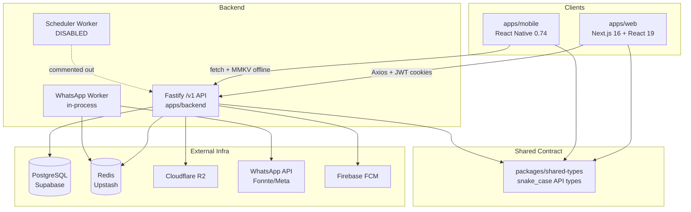
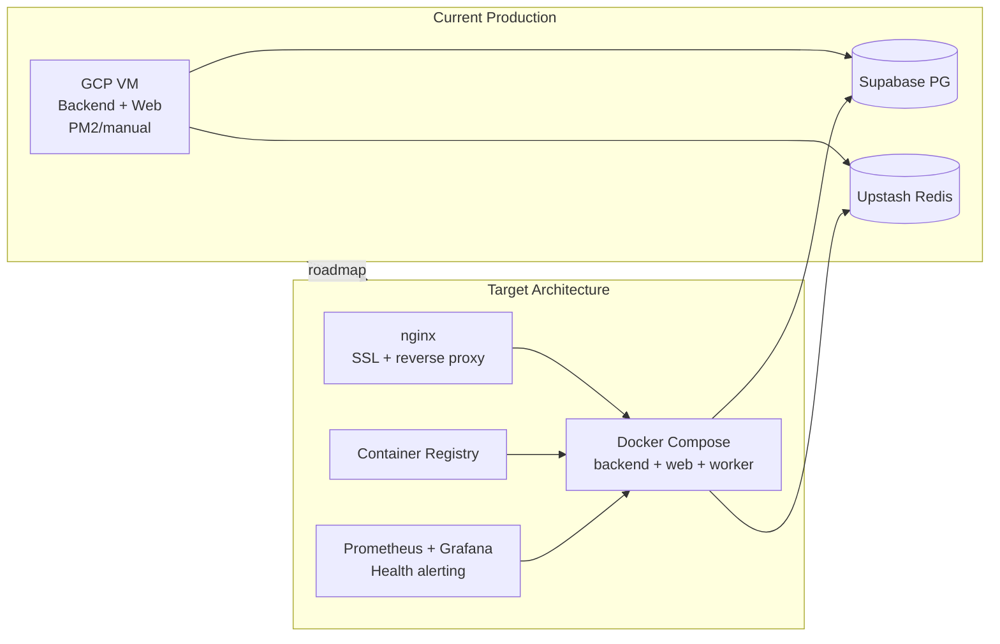

# Analisis Menyeluruh: Arsitektur & Infrastruktur Lazisnu

> Tanggal: 2026-07-21 | Scope: Kodebase (backend, web, mobile, shared-types) + Infrastruktur Produksi + Alur Data
> Dokumen ini adalah gabungan dari 3 hasil analisis sebelumnya (analisis arsitektur, plan analisis arsitektur, dan analisis infrastruktur) — seluruh temuan dipertahankan tanpa pengurangan.
>
> **Diperbarui 2026-07-21** berdasarkan laporan verifikasi `docs/review-verifikasi-analisis-arsitektur.md` — 4 klaim keliru diperbaiki, 8 klaim parsial diluruskan, 4 temuan baru ditambahkan.

---

## 1. Ringkasan Eksekutif

Lazisnu adalah sistem manajemen infaq berbasis **monorepo pnpm** dengan tiga aplikasi utama (`apps/backend`, `apps/web`, `apps/mobile`) dan satu package kontrak (`packages/shared-types`).

Secara **arsitektur aplikasi**, kodebase sudah matang untuk domain inti: data model solid, offline-first diimplementasikan dengan benar, prinsip immutability terjaga, RBAC granular, dan audit trail lengkap.

Secara **infrastruktur dan operasional**, sistem masih berada di **tahap awal (early-stage)** — wajar untuk produk yang baru berjalan, tapi harus segera diperkuat sebelum scale-up, karena:

1. Tidak ada quick recovery (tidak ada Docker, tidak ada IaC, tidak ada backup terjadwal)
2. Tidak ada observability (tidak tahu kalau server bermasalah sebelum user lapor)
3. Ada risiko keamanan (kredensial di file lokal, tidak ada secret management, JWT single secret)
4. Deploy masih manual (human error risk, rollback tidak mungkin)
5. Scheduler cron bulanan dinonaktifkan (assignment harus di-trigger manual)

**Rekomendasi utama:** mulai dengan containerization (Docker) + aktifkan scheduler + tambahkan test ke CI + monitoring sederhana (prom-client). Sisanya bertahap sesuai roadmap prioritas di Bab 15.

---

## 2. Identitas Proyek & Tiga Pilar Bisnis

Sumber: `.agents/rules/00-project-overview.md`

| Pilar | Implementasi di Kode |
|-------|---------------------|
| **Immutable audit trail** | `collections` INSERT-only + PostgreSQL RULE di `apps/backend/src/database/migrations/immutable-rule.sql`; koreksi via `submit_sequence` baru |
| **WhatsApp sebagai verifikasi eksternal** | Setiap submit koleksi → BullMQ queue → `whatsapp.worker.ts` → Fonnte/Meta API |
| **Offline-first mobile** | MMKV queue → batch sync ke `mobileSyncService.ts` |

> ⚠️ **Catatan verifikasi (Bab 2):** OTP mobile **tidak benar-benar dikirim via WhatsApp** — lihat temuan #33 (P1) di Bab 13.4.

**Peran pengguna:**

| Role | Platform | Scope Data |
|------|----------|------------|
| `ADMIN_KECAMATAN` | Web | Semua kecamatan/ranting |
| `ADMIN_RANTING` | Web | Ranting sendiri |
| `BENDAHARA` | Web | Read-only laporan + operasional |
| `PETUGAS` | Mobile | Tugas & koleksi milik sendiri |

---

## 3. Struktur Monorepo

```
lazisnu/
├── apps/
│   ├── backend/          # Fastify API — lazisnu-backend
│   ├── web/               # Next.js Dashboard — web
│   └── mobile/            # React Native — lazisnu-collector-app
├── packages/
│   ├── shared-types/      # @lazisnu/shared-types — kontrak API bersama
│   └── design-tokens/     # Token desain ⚠️ (skeleton/belum diimplementasi — hanya folder proposals/ kosong, tidak ada package.json)
├── docs/                  # ADR, schema SQL, API docs
└── pnpm-workspace.yaml    # Workspace config
```

**Package manager**: `pnpm@10.33.2` dengan `node >=18`. Semua app mengacu ke `@lazisnu/shared-types` via file reference.

**Build order wajib:** `shared-types` → `backend` / `web` (script `package.json`: `build:shared` → `build:all`)

**Konvensi API:** prefix `/v1`, payload snake_case, response wrapper `ApiResponse<T>` dari shared-types.



---

## 4. Tech Stack

| Layer | Teknologi | Versi |
|-------|-----------|-------|
| Backend | Node.js + Fastify + TypeScript | Fastify 4, TS 5.4 |
| ORM | Drizzle ORM + `drizzle-kit` | 0.45.2 / 0.31.10 |
| Database | PostgreSQL via Supabase | aws-1-ap-southeast-1 |
| Cache / Queue | Redis via Upstash + BullMQ | ioredis 5, BullMQ 5 |
| Web Dashboard | Next.js 16 + React 19 + Tailwind CSS v4 | Next 16.2.4 |
| Mobile | React Native 0.74 (Android only) | RN 0.74.1, Expo EAS |
| State (web) | Zustand 5 + SWR 2 | — |
| State (mobile) | Zustand 4 + MMKV | react-native-mmkv 2 |
| Storage File | Cloudflare R2 (S3-compatible) | AWS SDK v3 |
| WhatsApp | Fonnte API (+ fallback Meta Graph API) | — |
| Push Notif | Firebase Cloud Messaging (FCM) | firebase-admin 13 |
| Auth | JWT access (15m) + refresh (7d), OTP WA ⚠️ (lihat §13.4 temuan #33) | @fastify/jwt 8 |
| Monitoring | Sentry (backend + web + mobile Crashlytics) | — |
| Hosting | GCP VM tunggal (`34-101-78-252`) | nip.io DNS |

---

## 5. Arsitektur Backend

### 5.1 Struktur Folder

```
apps/backend/src/
├── app.ts              # Fastify setup, plugin register, error handler
├── index.ts            # Entry point, graceful shutdown
├── config/              # env.ts, database.ts, redis.ts, sentry.ts
├── database/
│   ├── schema.ts        # Seluruh tabel Drizzle ORM
│   ├── migrations/      # File migrasi
│   └── seed.ts
├── routes/
│   ├── auth.ts           # /v1/auth/*
│   ├── mobile/           # /v1/mobile/* (collections, tasks, sync, profile)
│   ├── admin/             # /v1/admin/* (8 sub-route terdaftar; `collections.ts` ada tapi tidak didaftarkan — dead route)
│   ├── bendahara.ts       # /v1/bendahara/*
│   ├── scheduler.ts        # /v1/scheduler/*
│   ├── health.ts          # /health/*
│   └── metrics.ts         # /metrics
├── middleware/
│   ├── auth.ts             # JWT verify + RBAC
│   ├── audit-logger.ts      # Audit trail setiap request
│   ├── ownership.ts          # Resource ownership check
│   └── correlationId.ts
├── services/             # 20 service files (lihat 5.5)
├── workers/
│   ├── whatsapp.worker.ts   # BullMQ consumer: kirim WA
│   └── scheduler.worker.ts  # BullMQ: generate assignment bulanan ⚠️ DINONAKTIFKAN
└── utils/                # AppError, errorCatalog, error-guards
```

**Entry:** `apps/backend/src/index.ts` — Fastify listen, WhatsApp worker aktif, **scheduler dinonaktifkan** (baris 6, 20-22, 33 dikomen).

### 5.2 Middleware Stack

Urutan (`app.ts`): Correlation ID → CORS → JWT → Rate limit (100/min) → Audit logger → Error handler. Swagger `/docs` hanya aktif di non-`production` **dan** non-`test` (`app.ts:58`: `NODE_ENV !== 'production' && NODE_ENV !== 'test'`).

### 5.3 Route Map

| Prefix | Auth | Roles | Fungsi |
|--------|------|-------|--------|
| `/v1/auth` | Sebagian public | All | Login, OTP request/verify, refresh token, logout, sessions |
| `/v1/mobile` | JWT | PETUGAS | Collections, tasks, sync, profile |
| `/v1/admin` | JWT + RBAC | ADMIN_* | Assignments, cans, officers, districts, dukuhs, WA monitor, audit (8 sub-route aktif; `collections.ts` dead route) |
| `/v1/bendahara` | JWT + role | BENDAHARA | Laporan koleksi (read-only) |
| `/v1/scheduler` | `x-internal-api-key` | Internal | Trigger manual generate assignments & summary |
| `/health` | ❌ | — | `GET /live`, `GET /ready` (DB + Redis ping) |
| `/metrics` | ❌ | — | Prometheus endpoint (⚠️ 501 karena `prom-client` tidak diinstall) |
| `/docs` | ❌ | Dev only | Swagger UI (disembunyikan di production) |

### 5.4 Status Worker

| Worker | Status | Queue | Catatan |
|--------|--------|-------|---------|
| WhatsApp | **Aktif** (in-process) | `whatsapp-notifications` | Rate 2 msg/s, dedup `jobId: collection-{id}`, attempts 3, backoff exponential 5000ms, `removeOnFail: false` (DLQ untuk debug) |
| Scheduler | **Nonaktif** ⚠️ | `lazisnu-scheduler` | Cron bulanan + DLQ cleanup mingguan; alternatif sementara: HTTP `/v1/scheduler/*` manual |

> **Risiko WA worker in-process:** karena worker berjalan di proses API yang sama, restart API = stop queue processing sementara.

### 5.5 Services Inventory (20 services)

| Service | Fungsi Utama |
|---------|-------------|
| `collectionSubmission.ts` | Submit koleksi baru, validasi, trigger WA |
| `collectionQueryService.ts` | Query koleksi dengan filter |
| `collectionReportService.ts` | Report PDF + agregasi |
| `collectionCorrectionService.ts` | Resubmit / koreksi koleksi |
| `canService.ts` | CRUD kaleng (can) + QR |
| `assignmentGenerator.ts` | Round-robin assignment bulanan |
| `dashboardService.ts` | Agregasi dashboard admin |
| `mobileSyncService.ts` | Batch sync dari mobile |
| `whatsapp.ts` | Send WA (Meta/Fonnte) + enqueue BullMQ |
| `queues.ts` | BullMQ queue definitions |
| `fcm.ts` | FCM push notification |
| `otp.ts` | Generate + verify OTP |
| `r2.ts` | Cloudflare R2 file operations |
| `qrPdfService.ts` | Generate PDF berisi QR code |
| `sessionService.ts` | Manage user sessions (JTI tracking) |
| `tokenService.ts` | Verify + revoke tokens |
| `officerService.ts` | CRUD officers |
| `auditLogService.ts` | Log audit actions |
| `qr.ts` | QR code generation |
| `dashboardReportService.ts` | Dashboard report aggregation |

---

## 6. Model Data & Database Schema

### 6.1 Entity Relationship

```
districts (1)──(many) branches (1)──(many) dukuhs
     │                    │
     │                    ├──(many) cans [kolom: qr_code varchar unique]
     │                    │               │
     │                    │           assignments ──(1) officers
     │                    │               │
     │                    │           collections ← immutable ledger
     │                    │               │
     │                    │         notifications (WA log)
     │
    users (1:1) officers ──(many) assignments [primary + backup]
                       └──(many) collections
                       └──(many) syncQueues (server-side queue)

    userSessions (per user, track JTI untuk token revocation)
    activityLogs (audit trail semua aksi)
    collectionSummaries (pre-aggregated report per period/district/branch/officer)
```

> ⚠️ **Catatan:** `qr_code` adalah **kolom varchar unique** di tabel `cans` (`schema.ts:73`), bukan tabel relasi terpisah.

**Tabel kunci tambahan:** `user_sessions`, `activity_logs`, `collection_summaries`, `sync_queues` (schema ada, **belum dipakai di kode aplikasi** — dead schema).

### 6.2 Tabel Kritis: `collections` (Immutable Append-Only Ledger)

```sql
collections (
  id UUID PK,
  assignment_id → assignments,
  can_id → cans,
  officer_id → officers,
  nominal BIGINT,           -- rupiah, bukan desimal
  offline_id VARCHAR UNIQUE, -- deduplication key dari mobile
  submit_sequence INTEGER,   -- versi: 1, 2, 3, ...
  alasan_resubmit TEXT,      -- wajib jika sequence > 1
  sync_status ENUM(PENDING, COMPLETED, FAILED, CANCELLED),
  device_info JSON,
  UNIQUE(assignment_id, can_id, submit_sequence)  -- mencegah duplikasi versi
)
```

> **Aturan bisnis kritis**: TIDAK BOLEH ada UPDATE/DELETE di `collections`. Koreksi = INSERT baru dengan `submit_sequence + 1`.

**Query "data terbaru":**
```sql
SELECT * FROM collections c1
WHERE submit_sequence = (
  SELECT MAX(submit_sequence)
  FROM collections c2
  WHERE c2.assignment_id = c1.assignment_id
  AND c2.can_id = c1.can_id
);
```

### 6.3 Enum Roles

```
user_role: ADMIN_KECAMATAN | ADMIN_RANTING | BENDAHARA | PETUGAS
```

> ⚠️ **Inkonsistensi**: `middleware/auth.ts:12` mendefinisikan `JWTPayload.role` mencakup `ADMIN_PUSAT | ADMIN_KABUPATEN` yang **tidak ada** di enum database. Ini potensi bug/security gap jika token mengandung role tersebut.

### 6.4 Strategi Migrasi — Hybrid & Berisiko

| Aspek | State | Risiko |
|-------|-------|--------|
| Journal resmi | 3 file (`0000`–`0002`) | OK untuk baseline |
| SQL legacy | 5+ file di luar journal (`0001_rename_nominal.sql`, dll) | Drift dev/prod |
| Dev workflow | `drizzle-kit push` via `db:push` script | Schema berubah tanpa migration file |
| Production | Manual SQL review | Human error, tidak otomatis di deploy |
| Immutable rule | PostgreSQL RULE terpisah | Harus diapply manual |

### 6.5 Connection Pool

`max: 10` di `database.ts:12` — cukup untuk ~100 petugas saat ini, tapi berpotensi jadi bottleneck saat peak usage / scale. Comment di `database.ts:10-11` menyebut: *"Disable prefetch as it is not supported for 'Transaction' pool mode if using **PgBouncer** / But we use direct connection usually here"* — artinya koneksi saat ini **langsung** (direct), bukan via Supabase pooler. Tidak ada tuning PgBouncer eksplisit.

---

## 7. Alur Data End-to-End

### 7.1 Submit Koleksi (Happy Path — Mobile)

```txt
Petugas tap tugas → Scan QR
  → apps/mobile/screens/CollectionScreen.tsx
  → useCollectionStore.submitCollection()
  → offline/queue.ts (MMKV enqueue, schema v2)
  → Optimistic UI update (tasks, dashboard)
  → sync.ts autoSync() jika online
  → POST /v1/mobile/collections/batch
  → routes/mobile/sync.ts
  → mobileSyncService.processSyncItem()
     1. Idempotency check via offline_id (ALREADY_SYNCED jika duplikat)
     2. validateAssignmentForSubmit + submitCollection (transaction)
     3. Queue WhatsApp notification (failure tidak rollback koleksi)
  → PostgreSQL collections INSERT
  → BullMQ whatsapp-notifications
      → whatsapp.worker.ts consumer
      → sendWhatsAppNotificationSync()
      → POST Fonnte/Meta API
      → INSERT notifications (log sukses/gagal)
  → BatchSyncResponse {results[]} → mobile dequeue sukses / retry / moveToFailed permanent
  → UI refresh (Zustand store update)
```

**Batas validasi:** QR valid, assignment aktif, periode belum disubmit, nominal > 0.

> ⚠️ **Dikoreksi:** Field `payment_method` telah **dihapus total** dari database (migrasi `0002_great_virginia_dare.sql` `DROP COLUMN "payment_method"` + `0004_remove_payment_method.sql`). `BatchCollectionItem` tidak punya field method; skema validasi batch memakai `.strict()` dan aktif menolak `payment_method`. Koleksi bersifat tunai secara implisit.

### 7.2 Offline-First Flow (Mobile)

```
Mobile (MMKV)
  ├── collection_queue_{userId}        — active queue
  ├── collection_queue_failed_{userId} — permanent failures
  └── offline_queue_schema_version_{userId} — migration version (current: v2)

Exponential backoff: 2^(retry_attempts-1) * 1000ms
Max retries: 3 kali per item
Deduplication: offline_id UUID unik per perangkat
```

**Klasifikasi error sync:** validation error → failed-permanent; server error → retry; `ALREADY_SYNCED` → dequeue.

### 7.3 Alur Auth

```txt
POST /v1/auth/login (email + password)
  → bcryptjs verify + Redis lockout (10 kali gagal)
  → generateTokens(): accessToken (15m) + refreshToken (7d, jti UUID)
  → INSERT user_sessions (JTI tracking)

Web: login page → /api/auth/login (Next.js Route Handler, proxy)
  → cookies: lazisnu_token (non-HttpOnly, dapat dibaca Axios & middleware)
            + lazisnu_refresh_token (HttpOnly)
  → middleware.ts role-based route guard
  (backend tidak expose refresh token ke client JS)

Mobile: OTP via WA ⚠️ (lihat catatan di bawah)
  → POST /v1/auth/request-otp → POST /v1/auth/verify-otp
  → tokens disimpan di encrypted MMKV / Keychain
  → apiRequest() dengan 401 → refresh → retry subscriber pattern

POST /v1/auth/refresh
  → verify refreshToken (JTI check via Redis `refresh:{jti}` — auth.ts:443-451)
  → user_sessions ditulis saat login/refresh, tapi tidak dibaca saat validasi refresh
  → return new accessToken

Middleware authenticate():
  → jwtVerify()
  → db lookup user (isActive check)
  → attach currentUser ke request
```

> ⚠️ **`lazisnu_token` sengaja non-HttpOnly** agar dapat dibaca oleh Axios & middleware client-side. Ini membuka risiko XSS dapat membaca access token.

> ⚠️ **OTP tidak benar-benar dikirim:** `routes/auth.ts:260-263` hanya menulis log (`'OTP generated and sent to WhatsApp'`) tanpa memanggil `services/whatsapp.ts`. Login mobile via OTP pada praktiknya tidak akan menerima OTP. Ini temuan P1 — lihat §13.4 temuan #33.

**Session registry:** Redis `refresh:{jti}` + PostgreSQL `user_sessions` (`sessionService.ts`).

> ⚠️ **Redis fallback auth bypass**: `tokenService.ts:32` mengembalikan `'redis-unavailable'` yang **mengizinkan refresh** ketika Redis down — ini melemahkan proteksi revocation saat Redis bermasalah.

### 7.4 WhatsApp Queue Architecture

```
Collection Submit
  → addWhatsAppJob(data) [BullMQ: whatsapp-notifications]
      attempts: 3
      backoff: exponential, 5000ms initial
      removeOnComplete: true
      removeOnFail: false (DLQ untuk debug)

BullMQ Worker (whatsapp.worker.ts)
  → sendWhatsAppNotificationSync()
  → WA_PROVIDER switch: fonnte | meta
  → INSERT notifications (log sukses/gagal)

Scheduler (weekly, saat aktif): cleanup Redis DLQ
  → queue.clean(7days, 1000, 'failed')
```

### 7.5 Admin Dashboard

```txt
Web dashboard page → lib/api.ts (Axios)
  → /v1/admin/* atau /v1/bendahara/*
  → authenticate + authorize(role) middleware
  → service layer (dashboardService, collectionReportService, officerService, dll)
  → Drizzle queries dengan scope district/branch
```

---

## 8. Scheduler Worker — Status: DINONAKTIFKAN ⚠️

File `apps/backend/src/index.ts` baris 6 dan 20-22:
```typescript
// import { schedulerWorker, registerMonthlyAssignmentCron } from './workers/scheduler.worker';
// if (config.NODE_ENV !== 'test') {
//   await registerMonthlyAssignmentCron();
// }
```

**Dampak**: Assignment bulanan tidak otomatis ter-generate. Harus di-trigger manual via `POST /v1/scheduler/generate-assignments`. Risiko: data tidak konsisten jika lupa trigger.

**Solusi**: Uncomment 3 baris di `index.ts` + uncomment `schedulerWorker.close()` di graceful shutdown.

**Opsi arsitektur untuk scheduler** (lihat juga Bab 13 Trade-offs): aktifkan BullMQ cron in-process **dan** pertahankan HTTP `/v1/scheduler/*` sebagai fallback manual — bukan salah satu saja.

---

## 9. Web Dashboard Architecture

```
apps/web/src/
├── app/
│   ├── (auth)/            # Login page
│   ├── api/                # Next.js API routes (proxy / BFF, termasuk app/api/auth/)
│   ├── dashboard/          # Protected routes
│   │   ├── overview/       # Dashboard utama
│   │   ├── assignments/    # Manajemen penugasan
│   │   ├── cans/           # Manajemen kaleng
│   │   ├── users/          # Manajemen user
│   │   ├── master/         # Data master (district, branch)
│   │   ├── reports/        # Laporan
│   │   ├── resubmit/       # Koreksi koleksi
│   │   ├── audit-log/      # Audit trail
│   │   └── wa-monitor/     # WhatsApp notification monitor
│   └── layout.tsx          # Root layout
├── components/             # Shared UI components
├── lib/                    # API client, utils
├── store/                  # Zustand stores
└── middleware.ts           # Auth middleware (jose JWT verify, RBAC redirect per route)
```

**Stack**: Next.js 16 App Router, React 19, Tailwind CSS v4, TanStack Table, Recharts, SWR, Zustand 5, react-hook-form + Zod, Sentry.

**Auth proxy**: Route handler di `app/api/auth/` memastikan backend tidak expose refresh token ke client JS secara langsung.

---

## 10. Mobile App Architecture

```
apps/mobile/src/
├── screens/
│   ├── LoginScreen.tsx      # Email + password
│   ├── OTPScreen.tsx        # OTP via WA ⚠️ (OTP tidak benar-benar terkirim — lihat §13.4)
│   ├── DashboardScreen.tsx  # Ringkasan tugas
│   ├── TasksScreen.tsx      # Daftar penugasan
│   ├── ScanScreen.tsx       # QR scanner + geo
│   ├── CollectionScreen.tsx # Input nominal + submit
│   ├── HistoryScreen.tsx    # Riwayat koleksi
│   └── ProfileScreen.tsx
├── components/
│   └── ui/                  # 9 komponen UI shared
├── services/
│   ├── api.ts               # fetch-based client (⚠️ hardcode https://api.lazisnu.app/v1; bukan Axios)
│   ├── offline/
│   │   ├── mmkv.ts          # Encrypted MMKV storage
│   │   ├── queue.ts         # MMKV queue management, per-officer keys, schema v2, max 3 retries
│   │   ├── sync.ts          # AutoSync + NetInfo listener + module lock + exponential backoff
│   │   ├── cache.ts         # Cache manajemen
│   │   └── tasks.ts         # Offline tasks
│   ├── secureStorage.ts     # Keychain storage
│   ├── secureKey.ts         # Key management
│   ├── qrImageScanner.ts    # QR image scanning
│   └── security.ts          # App integrity checks
├── config/
│   └── crashlytics.ts       # Firebase Crashlytics config
├── utils/
│   ├── error.ts
│   └── device.ts
├── stores/                  # 6 Zustand stores: auth, collection, dashboard, officer, sync, tasks
├── navigation/              # React Navigation (stack + bottom tabs)
└── theme/                   # Design tokens
```

**Dependencies kritis**:
- `react-native-mmkv` — offline queue storage
- `@react-native-community/netinfo` — network change detection
- `react-native-camera-kit` — QR scanning
- `react-native-keychain` — secure token storage
- Firebase Crashlytics — crash reporting

> Context switch dev/prod dilakukan via `__DEV__`, tapi URL API tetap hardcoded, sehingga tidak bisa ganti API URL tanpa rebuild app.

> ⚠️ **Dikoreksi:** `api.ts` menggunakan **`fetch`** native (baris 118, 163, 178, 419) — **bukan Axios**. Axios tidak ada di `apps/mobile/package.json`. (Axios dipakai di `apps/web`, bukan mobile.)

---

## 11. `packages/shared-types` (Shared Types Contract)

Satu file `src/index.ts` (~12KB) berisi semua TypeScript type yang digunakan oleh backend, web, dan mobile:
- Enums: `UserRole`, `AssignmentStatus`, `SyncStatus`
- API request/response types & domain models (`BatchCollectionRequestItem`, `BatchSyncResponse`, dll)
- Offline types: `OfflineCollection`, `DeviceInfo`

**Aturan / pola yang benar**: perubahan kontrak API harus selalu diupdate di sini terlebih dahulu, lalu rebuild, sebelum diimplementasikan di app (sudah digate oleh CI typecheck).

---

## 12. Kekuatan Arsitektur yang Sudah Baik

✅ **Immutable ledger pattern** — `collections` tidak bisa diubah, resubmit via INSERT baru
✅ **Offline-first yang solid** — MMKV queue + exponential backoff + deduplication via `offline_id`
✅ **RBAC yang granular** — 4 role dengan middleware `authorize()` per route
✅ **Shared types** — satu sumber kebenaran untuk kontrak API
✅ **Error handling terpusat** — `setErrorHandler()` di `app.ts` menangani semua error type
✅ **Audit trail lengkap** — `activityLogs` + audit middleware
✅ **Session management** — JTI tracking di `user_sessions` untuk token revocation
✅ **WA Queue async** — BullMQ prevent blocking API response saat WA lambat
✅ **Schema migration tracking (mobile)** — MMKV schema version `v2` dengan recovery logic
✅ **Correlation ID** — setiap request punya ID untuk tracing

---

## 13. Infrastruktur — Yang Sudah Ada vs Gap

### 13.1 Yang Sudah Ada

| Komponen | Detail |
|----------|--------|
| Hosting | GCP VM tunggal (`34-101-78-252`) |
| Database | PostgreSQL via Supabase (ap-southeast-1) |
| Cache/Queue | Redis via Upstash + BullMQ |
| Storage | Cloudflare R2 (QR PDF) |
| CI | `.github/workflows/ci.yml`: lint + typecheck saja |
| Health checks | `/health/live`, `/health/ready` (cek DB + Redis) |
| Error tracking | Sentry optional (dynamic import), sampling 10% |
| Env validation | Zod schema di `env.ts`, termasuk nilai `staging` (tapi environment staging-nya sendiri belum ada) |
| Test suite | **28 test files** (backend + mobile) — **tidak dijalankan di CI** |

### 13.2 Diagram Arsitektur Produksi: Current vs Ideal



### 13.3 Temuan P0 — Harus Diperbaiki Sekarang

| # | Temuan | Lokasi / Bukti | Dampak |
|---|--------|-----------------|--------|
| 1 | **Scheduler worker dinonaktifkan** | `index.ts:6,20-22,33` dikomen | Assignment bulanan tidak auto-generate; harus trigger manual |
| 2 | **Tidak ada Docker/containerization** | Tidak ada Dockerfile di seluruh repo | Environment drift, sulit reproduce, onboarding lambat, rollback impossible |
| 3 | **Deploy masih manual via SSH** | Tidak ada build artifact / deploy step di CI, SSH ke VM `34-101-78-252` | Human error, downtime tidak terkontrol, tidak ada version history |
| 4 | **Test tidak dijalankan di CI** | `ci.yml` hanya lint + typecheck | 28 test files yang sudah ada tidak pernah gate merge; bug lolos ke production |
| 5 | **Backup database tidak dikonfigurasi** | Tidak ada evidence pg_dump cron / kebijakan backup Supabase di kode | Risiko data hilang permanen jika disaster |
| 6 | **Migrasi schema tidak otomatis** | `drizzle-kit push` (`db:push`) dipakai, bukan `drizzle-kit migrate`; production masih manual SQL review | Schema drift dev ↔ production, human error |
| 7 | **Kredensial / secrets di `.env` plaintext** | File `.env` backend & web berisi real creds (meski di `.gitignore`) | Jika terlanjur commit, kredensial bocor permanen |

### 13.4 Temuan P1 — Perbaiki Bulan Ini

| # | Temuan | Lokasi / Bukti | Dampak |
|---|--------|-----------------|--------|
| 8 | **VM tunggal (SPOF)** | Backend + web di satu VM, tanpa load balancer / reverse proxy | Single point of failure, tidak ada SSL termination terpusat |
| 9 | **Tanpa environment staging** | `NODE_ENV` schema mendukung `staging`, tapi environment staging aktual belum ada | Tidak bisa testing deployment sebelum production |
| 10 | **`prom-client` tidak terinstall** | `routes/metrics.ts:30-37` → endpoint `/metrics` return 501 | Tidak ada metrik server (CPU, memory, request rate, latency), tidak bisa alerting otomatis |
| 11 | **Tidak ada structured logging** | Masih `console.log` / Fastify default logger; `whatsapp.worker.ts:37,42` juga pakai `console.log` | Tidak bisa query/search log, sulit debug insiden, tidak ada severity level |
| 12 | **Tidak ada alerting** | Tidak ada notifikasi Telegram/Slack/email untuk error kritis atau health check gagal | Tidak tahu server mati sampai user complain |
| 13 | **Health check tidak dimonitor** | `/health/live` & `/health/ready` ada tapi tidak dipantau siapa pun | Deployment tidak tahu service benar-benar siap layani traffic |
| 14 | **Inkonsistensi role enum** | `middleware/auth.ts:12` (`ADMIN_PUSAT`, `ADMIN_KABUPATEN`) tidak ada di enum database | Potensi auth bypass / bug jika role tersebut muncul di token |
| 15 | **JWT single secret** | `JWT_ACCESS_SECRET` & `JWT_REFRESH_SECRET` ada di env schema tapi `optional()`, saat ini hanya 1 secret dipakai | Satu secret bocor = semua token (access & refresh) rentan |
| 16 | **CORS origin: `true`** | `app.ts:35` | Menerima request dari semua origin di production |
| 17 | **Redis fallback mengizinkan auth bypass** | `tokenService.ts:32` return `'redis-unavailable'` → refresh tetap diizinkan | Saat Redis down, proteksi revocation token melemah |
| 18 | **WhatsApp worker in-process** | Worker berjalan di proses API yang sama | Restart API = stop queue processing sementara |
| 31 | **⭐ Guard `/v1/scheduler` fail-open jika `INTERNAL_API_KEY` tidak diset** | `routes/scheduler.ts:23`: `if (config.INTERNAL_API_KEY && apiKey !== ...)` — short-circuit jika env kosong, semua request lolos | Endpoint trigger generate-assignments jadi **terbuka tanpa autentikasi** |
| 32 | **`lazisnu_token` cookie non-HttpOnly** | `app/api/auth/login/route.ts:40-56` — sengaja non-HttpOnly agar dapat dibaca Axios & middleware | XSS dapat membaca access token |
| 33 | **⭐ OTP login mobile tidak benar-benar terkirim via WA** | `routes/auth.ts:260-263` — hanya `console.log` tanpa panggil `services/whatsapp.ts` | Login mobile via OTP di lapangan tidak akan menerima OTP |

### 13.5 Temuan P2 — Sprint Berikutnya

| # | Temuan | Lokasi / Bukti | Dampak |
|---|--------|-----------------|--------|
| 19 | **API URL hardcoded di mobile** | `mobile/src/services/api.ts:42` (`https://api.lazisnu.app`) | Tidak bisa ganti API URL tanpa rebuild app |
| 20 | **Tidak ada secret rotation** | Tidak ada mekanisme rotate JWT secret / DB password / third-party keys | Jika kredensial bocor, tidak ada cara cepat memperbaiki |
| 21 | **DB connection pool rendah** | `database.ts:12` — `max: 10` | Request timeout saat peak usage |
| 22 | **Koneksi DB direct, tanpa PgBouncer/pooler** | `database.ts:10-11` — komentar menyebut direct connection biasanya dipakai; PgBouncer tidak dikonfigurasi | Koneksi tidak optimal di production, N+1 connection risk |
| 23 | **Sentry sampling rendah** | Backend sampling rate 0.1 (10%) | Error jarang tapi kritis bisa tidak ter-capture |
| 24 | **`@sentry/node` optional install** | Dynamic import — mungkin tidak aktif | Observability error tidak konsisten |
| 25 | **`sync_queues` — dead schema** | Tabel ada di schema tapi belum dipakai di kode aplikasi | Schema membingungkan, technical debt |
| 26 | **Tidak ada log terpusat** | Tidak ada log shipping ke Grafana Loki/ELK/Datadog | Log hilang saat proses crash/restart, sulit tracing antar-service |
| 27 | **`zod` di `devDependencies` web** | `apps/web/package.json:46` — `zod` ada di devDep padahal dipakai untuk validasi form runtime | Potensi runtime error di production build yang mem-prune devDependencies |

### 13.6 Temuan P3 — Dampak Kecil

| # | Temuan | Lokasi / Bukti | Dampak |
|---|--------|-----------------|--------|
| 28 | **Swagger UI nonaktif di production & test** | `app.ts:58` (`NODE_ENV !== 'production' && NODE_ENV !== 'test'`) | Tim lain / stakeholder tidak bisa akses API docs di production |
| 29 | **Dead route file `routes/admin/collections.ts`** | File ada tapi tidak didaftarkan di `routes/admin/index.ts` | Dead code, membingungkan, risiko aktif tidak sengaja |
| 30 | **`packages/shared-types/package-lock.json`** | File `package-lock.json` (npm) ada di dalam package pnpm monorepo | Inkonsistensi tooling, menimbulkan kebingungan |

### 13.7 Gap Infrastructure-as-Code & Reproducibility

| Isu | Current State | Rekomendasi |
|-----|--------------|-------------|
| **Tidak ada IaC** | Server GCP VM di-setup manual. Tidak ada Terraform, Ansible, atau dokumentasi provisioning. | Jika server harus di-rebuild, tidak ada panduan; time to recover tinggi |
| **Tidak ada dev environment containerized** | Developer harus setup PostgreSQL + Redis lokal manual. `pnpm dev` tidak langsung bisa. | Buat `docker-compose.yml` untuk dev: PostgreSQL + Redis + backend + web |
| **Tidak ada dokumentasi deployment** | Tidak ada runbook "cara deploy ulang server" | Buat `docs/DEPLOYMENT.md` berisi langkah provisioning VM, setup nginx, HTTPS, deploy |

---

## 14. Rekomendasi CI/CD Pipeline Ideal

```
push/PR ke main
  → install deps
  → build shared-types
  → lint + typecheck
  → unit tests + integration tests (backend)
  → build Docker images (backend + web)
  → push ke container registry (Docker Hub / GCP Artifact Registry)
  → deploy ke staging (auto)
  → smoke test staging
  → deploy ke production (manual approval / tag release)
```

---

## 15. Trade-offs & Rekomendasi

| Keputusan | Opsi A | Opsi B | Rekomendasi |
|-----------|--------|--------|-------------|
| Scheduler | Aktifkan BullMQ cron in-process | HTTP cron eksternal (Cloud Scheduler → `/v1/scheduler`) | **A + B**: aktifkan cron, pertahankan HTTP sebagai fallback manual |
| Worker deployment | In-process (current) | Proses terpisah via Docker | **Proses terpisah** saat Docker sudah siap — isolasi restart |
| Migrasi | `drizzle-kit push` (dev speed) | `drizzle-kit migrate` (versioned) | **Migrate** untuk staging/prod; `push` hanya local dev |
| CI scope | Lint + typecheck (current) | + unit test + integration test | **Tambah test** — 28 file sudah ada, ROI tinggi |
| Observability | Sentry saja | + prom-client + health alerting | **Keduanya** — Sentry untuk error, Prometheus untuk SLA |

---

## 16. Roadmap Implementasi (Konsolidasi Prioritas)

### Sekarang / Minggu Ini — Quick Wins, Biaya ~Rp0

1. **Aktifkan scheduler worker** — uncomment `index.ts:6,20-22,33` + `schedulerWorker.close()` di graceful shutdown
2. **Perbaiki CORS** — ganti `origin: true` → parse `CORS_ORIGINS` dari env
3. **Perbaiki inkonsistensi role enum** di `middleware/auth.ts`
4. **Install `prom-client`** (`pnpm add prom-client`) — route `/metrics` sudah siap
5. **Tambahkan `pnpm test` / `pnpm --filter lazisnu-backend test:unit`** ke CI workflow
6. **Audit & rotate semua secrets** yang ada di `.env` lokal, pastikan tidak pernah commit
7. **Buat `Dockerfile`** (multi-stage, backend + web) + `.dockerignore`
8. **Buat `docker-compose.yml`** — PostgreSQL + Redis + backend + web untuk dev environment, cukup `docker compose up`

### Bulan Ini — Fondasi

9. **Migrasi workflow**: `drizzle-kit migrate` dijalankan saat startup container (bukan `push`)
10. **Setup nginx reverse proxy** di VM — SSL termination via Let's Encrypt, gzip, static asset cache untuk Next.js
11. **CI build Docker image** → push ke registry (Docker Hub / GCP Artifact Registry), belum auto-deploy
12. **Upgrade ke structured logging (Pino)** — native/kompatibel dengan Fastify
13. **Health check monitoring** — cron curl ke `/health/ready` + notifikasi Telegram webhook
14. **Pisahkan JWT_ACCESS_SECRET dan JWT_REFRESH_SECRET** — wajib, bukan optional
15. **Pisahkan WhatsApp worker** ke container/proses terpisah dari API
16. **Setup Supabase automated backup** (cek Pro plan di dashboard)
17. **Buat `docs/DEPLOYMENT.md`** — runbook provisioning VM, nginx, HTTPS, deploy

### 1–3 Bulan ke Depan — Maturity

18. **Staging environment** aktual (env schema sudah mendukung `staging`)
19. **Deploy otomatis ke staging** + manual approval untuk production
20. **Setup Grafana + Prometheus** untuk dashboard monitoring
21. **Database backup terjadwal** + test restore rutin
22. **Infrastructure as Code** — Terraform/Ansible untuk provisioning GCP VM
23. **Blue-green deployment** — zero-downtime deploy
24. **Database connection pool tuning** + konfigurasi PgBouncer eksplisit

---

## 17. Learning Checkpoint

**Konsep kunci yang dipakai:**
- **Monorepo pnpm** dengan shared contract package
- **Append-only ledger** — data keuangan tidak boleh di-mutate, hanya di-append
- **Offline-first with idempotency** — `offline_id` sebagai natural deduplication key
- **CQRS lite** — command (submit) dan query terpisah di service layer
- **Saga pattern sederhana** — submit koleksi → queue WA → worker → log notifikasi
- **BullMQ job deduplication** — `jobId: collection-{id}` mencegah duplicate job
- **JWT access/refresh rotation** dengan JTI allowlist di Redis

**File yang perlu dipahami:**
- `apps/backend/src/database/schema.ts` — seluruh model data
- `apps/backend/src/app.ts` — bootstrap server
- `apps/backend/src/middleware/auth.ts` — RBAC
- `apps/backend/src/services/mobileSyncService.ts` — sync pipeline
- `apps/backend/src/services/collectionSubmission.ts` — business rules koleksi
- `apps/mobile/src/services/offline/queue.ts` — offline queue MMKV
- `apps/mobile/src/services/offline/sync.ts` — sync logic
- `apps/web/src/middleware.ts` — RBAC web
- `packages/shared-types/src/index.ts` — API contract

**Cara mengetes:**
```bash
pnpm build:shared
pnpm --filter lazisnu-backend test:unit
pnpm --filter lazisnu-backend test:integration   # butuh .env.test + DB
pnpm --filter lazisnu-backend test:all
pnpm --filter lazisnu-collector-app test
curl http://localhost:3001/health/ready
```

**Latihan kecil:**
- Trace satu submit koleksi dari `useCollectionStore` sampai row di `collections` + job di BullMQ
- Identifikasi 3 route admin yang scope data berbeda per role
- Bandingkan isi journal migrasi (`0002`) vs SQL legacy yang belum di journal

---

## 18. Appendix: Ringkasan Tech Stack

| Layer | Teknologi |
|-------|-----------|
| Backend | Node.js + Fastify 4 (TypeScript), Drizzle ORM, BullMQ |
| Web Dashboard | Next.js 16 (App Router), React 19, Tailwind CSS v4 |
| Mobile App | React Native 0.74 (Android), Expo EAS |
| Database | PostgreSQL via Supabase (aws-1-ap-southeast-1) |
| Cache/Queue | Redis via Upstash + BullMQ |
| Storage | Cloudflare R2 (S3-compatible) |
| WhatsApp | Fonnte API |
| Push Notification | Firebase Cloud Messaging |
| Monitoring | Sentry, Firebase Crashlytics |
| Auth | JWT (access 15min + refresh 7 hari), OTP via WA |
| Hosting | GCP VM (34-101-78-252), nip.io DNS |
