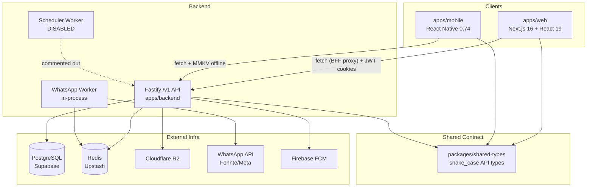
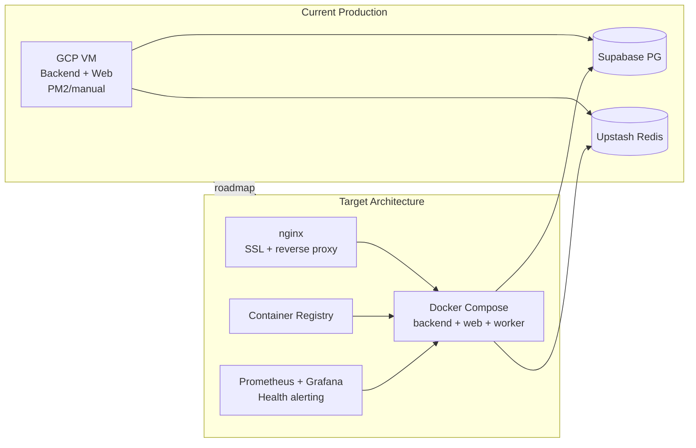

# Analisis Master Lazisnu — Arsitektur, Kode, Infrastruktur & Roadmap

> Tanggal konsolidasi: 2026-07-21
> Dokumen ini adalah **satu-satunya sumber kebenaran (single source of truth)** hasil konsolidasi 3 dokumen:
> 1. `analisis-arsitektur-infrastruktur-lazisnu-gabungan.md` — analisis arsitektur + infrastruktur (sudah **dikoreksi** di sini)
> 2. `review-verifikasi-analisis-arsitektur.md` — hasil verifikasi klaim-per-klaim (dirangkum di Appendix A–B)
> 3. `analisis-mendalam-kodebase-lazisnu.md` (rev. 2) — analisis kode independen + rekomendasi + rencana implementasi final
>
> Semua nomor baris kode merujuk ke state kodebase saat verifikasi/pembacaan langsung pada 2026-07-21.
> Koreksi terhadap dokumen sumber diterapkan langsung di isi dokumen ini dan didaftarkan di Appendix B.

---

# BAGIAN I — ARSITEKTUR APLIKASI

## 1. Ringkasan Eksekutif

Lazisnu adalah sistem manajemen infaq berbasis **monorepo pnpm** dengan tiga aplikasi utama (`apps/backend`, `apps/web`, `apps/mobile`) dan satu package kontrak (`packages/shared-types`).

**Kondisi arsitektur aplikasi:** matang untuk domain inti — data model solid, offline-first diimplementasikan dengan benar, prinsip immutability terjaga berlapis, RBAC granular, audit trail lengkap.

**Kondisi lapisan autentikasi/sesi (hasil analisis kode mendalam):** memiliki **3 celah kritis (P0)** — OTP tidak pernah dikirim, pencabutan sesi tidak mencabut refresh token, dan blacklist access token tidak pernah diperiksa — ditambah 5 temuan P1 dan 9 temuan P2. **✅ Semua temuan P0/P1/P2 sudah diperbaiki per 2026-07-29 (Sub-bab 02-07).**

**Kondisi infrastruktur & operasional:** masih **tahap awal (early-stage)** — wajar untuk produk baru berjalan, tapi harus segera diperkuat sebelum scale-up:

1. Tidak ada quick recovery (tidak ada Docker, tidak ada IaC, tidak ada backup terjadwal)
2. Tidak ada observability (tidak tahu kalau server bermasalah sebelum user lapor)
3. Ada risiko keamanan (kredensial di file lokal, tidak ada secret management, JWT single secret)
4. Deploy masih manual (human error risk, rollback tidak mungkin)
5. Scheduler cron bulanan dinonaktifkan (assignment harus di-trigger manual)

**Rekomendasi utama (gabungan seluruh analisis):**
- **Minggu 1 — keamanan kode:** CORS whitelist, scheduler fail-closed, perbaikan revoke sesi, hapus blacklist dead code, putuskan arah OTP.
- **Paralel — fondasi infra:** containerization (Docker), aktifkan scheduler, tambahkan test ke CI, monitoring sederhana (prom-client + alert Telegram).
- Sisanya bertahap sesuai roadmap konsolidasi di Bab 23.

---

## 2. Identitas Proyek & Tiga Pilar Bisnis

Sumber: `.agents/rules/00-project-overview.md`

| Pilar | Implementasi di Kode |
|-------|---------------------|
| **Immutable audit trail** | `collections` INSERT-only + PostgreSQL RULE di `apps/backend/src/database/migrations/immutable-rule.sql`; koreksi via `submit_sequence` baru |
| **WhatsApp sebagai verifikasi eksternal** | Setiap submit koleksi → BullMQ queue → `whatsapp.worker.ts` → Fonnte/Meta API |
| **Offline-first mobile** | MMKV queue → batch sync ke `mobileSyncService.ts` |

> ⚠️ **Catatan koreksi:** klaim turunan "OTP via WhatsApp" untuk login petugas **tidak terbukti di kode** — OTP di-generate tapi tidak pernah dikirim (lihat temuan P0-1, Bab 12).

**Peran pengguna:**

| Role | Platform | Scope Data |
|------|----------|------------|
| `ADMIN_KECAMATAN` | Web | Semua kecamatan/ranting |
| `ADMIN_RANTING` | Web | Ranting sendiri |
| `BENDAHARA` | Web | Read-only laporan + operasional |
| `PETUGAS` | Mobile | Tugas & koleksi milik sendiri |

---

## 3. Struktur Monorepo

```
lazisnu/
├── apps/
│   ├── backend/          # Fastify API — lazisnu-backend
│   ├── web/               # Next.js Dashboard — web
│   └── mobile/            # React Native — lazisnu-collector-app
├── packages/
│   ├── shared-types/      # @lazisnu/shared-types — kontrak API bersama
│   └── design-tokens/     # ⚠️ skeleton kosong (hanya subfolder proposals/, tanpa package.json)
├── docs/                  # ADR, schema SQL, API docs
└── pnpm-workspace.yaml    # Workspace config
```

**Package manager**: `pnpm@10.33.2` dengan `node >=18`. Semua app mengacu ke `@lazisnu/shared-types` via file reference.

**Build order wajib:** `shared-types` → `backend` / `web` (script `package.json`: `build:shared` → `build:all`)

**Konvensi API:** prefix `/v1`, payload snake_case, response wrapper `ApiResponse<T>` dari shared-types.



---

## 4. Tech Stack

Seluruh versi di tabel ini telah **diverifikasi langsung** ke `package.json` masing-masing app:

| Layer | Teknologi | Versi Terverifikasi |
|-------|-----------|---------------------|
| Backend | Node.js + Fastify + TypeScript | Fastify ^4.27.0, TS ^5.4.5 |
| ORM | Drizzle ORM + `drizzle-kit` | ^0.45.2 / ^0.31.10 |
| Database | PostgreSQL via Supabase | aws-1-ap-southeast-1 |
| Cache / Queue | Redis via Upstash + BullMQ | ioredis ^5.4.1, BullMQ ^5.74.1 |
| Web Dashboard | Next.js 16 + React 19 + Tailwind CSS v4 | Next 16.2.4, React 19.2.4 |
| Mobile | React Native 0.74 (Android only) | RN 0.74.1, Expo EAS |
| State (web) | Zustand ^5.0.12 + SWR ^2.4.1 | — |
| State (mobile) | Zustand ^4.5.2 + MMKV | react-native-mmkv ^2.12.2 |
| Storage File | Cloudflare R2 (S3-compatible) | @aws-sdk/client-s3 ^3.1034.0 |
| WhatsApp | Fonnte API (+ fallback Meta Graph API) | switch `WA_PROVIDER` |
| Push Notif | Firebase Cloud Messaging (FCM) | firebase-admin ^13.8.0 |
| Auth | JWT access (15m) + refresh (lihat Bab 20: 365d), OTP via WA ⚠️ belum fungsional | @fastify/jwt ^8.0.0 |
| Monitoring | Sentry (backend + web) + mobile Crashlytics | @sentry/nextjs ^10.49.0, @react-native-firebase/crashlytics ^24.1.1 |
| Hosting | GCP VM tunggal (`34-101-78-252`) | nip.io DNS |

---

## 5. Arsitektur Backend

### 5.1 Struktur Folder

```
apps/backend/src/
├── app.ts              # Fastify setup, plugin register, error handler
├── index.ts            # Entry point, graceful shutdown
├── config/              # env.ts, database.ts, redis.ts, sentry.ts
├── database/
│   ├── schema.ts        # Seluruh tabel Drizzle ORM
│   ├── migrations/      # File migrasi
│   └── seed.ts
├── routes/
│   ├── auth.ts           # /v1/auth/*
│   ├── mobile/           # /v1/mobile/* (collections, tasks, sync, profile)
│   ├── admin/             # /v1/admin/* (8 sub-route terdaftar — lihat catatan)
│   ├── bendahara.ts       # /v1/bendahara/*
│   ├── scheduler.ts        # /v1/scheduler/*
│   ├── health.ts          # /health/*
│   └── metrics.ts         # /metrics
├── middleware/
│   ├── auth.ts             # JWT verify + RBAC
│   ├── audit-logger.ts      # Audit trail setiap request
│   ├── ownership.ts          # Resource ownership check
│   └── correlationId.ts
├── services/             # Tepat 20 service files (lihat 5.5)
├── workers/
│   ├── whatsapp.worker.ts   # BullMQ consumer: kirim WA
│   └── scheduler.worker.ts  # BullMQ: generate assignment bulanan ⚠️ DINONAKTIFKAN
└── utils/                # AppError, errorCatalog, error-guards
```

**Entry:** `apps/backend/src/index.ts` — Fastify listen, WhatsApp worker aktif, **scheduler dinonaktifkan** (baris 6, 20-22, 33 dikomen — terverifikasi persis).

### 5.2 Middleware Stack

Urutan (`app.ts`): Correlation ID (`:31`) → CORS (`:34-37`, `origin: true`) → JWT (`:39-42`) → Rate limit 100/menit (`:44-56`) → Audit logger (`:83`) → Error handler (`:86`). Swagger `/docs` hanya aktif di luar `production` **dan** `test` (`:58`).

### 5.3 Route Map

| Prefix | Auth | Roles | Fungsi |
|--------|------|-------|--------|
| `/v1/auth` | Sebagian public | All | Login, OTP request/verify, refresh token, logout, sessions |
| `/v1/mobile` | JWT | PETUGAS | Collections, tasks, sync, profile |
| `/v1/admin` | JWT + RBAC | ADMIN_* | Assignments, cans, officers, districts, dukuhs, WA monitor, audit, dashboard |
| `/v1/bendahara` | JWT + role | BENDAHARA + ADMIN_KECAMATAN + ADMIN_RANTING | Laporan koleksi (read-only) — multi-role by design (`bendahara.ts:15`) |
| `/v1/scheduler` | `x-internal-api-key` ⚠️ fail-open | Internal | `/generate-tasks`, `/calculate-summaries`, `/stats` |
| `/health` | ❌ | — | `GET /live`, `GET /ready` (DB + Redis ping), alias `GET /health` |
| `/metrics` | ❌ | — | Prometheus endpoint (⚠️ 501 karena `prom-client` tidak diinstall) |
| `/docs` | ❌ | Dev only | Swagger UI (nonaktif di production & test) |

> **Koreksi jumlah sub-route admin:** folder `routes/admin/` berisi 11 file, tetapi `routes/admin/index.ts:18-25` hanya mendaftarkan **8 sub-route** (dukuhs, dashboard, cans, officers, assignments, district, wa, audit). `schemas.ts` adalah validasi (bukan route), dan **`collections.ts` ada tetapi tidak pernah didaftarkan** (dead route — lihat temuan P3).

### 5.4 Status Worker

| Worker | Status | Queue | Catatan |
|--------|--------|-------|---------|
| WhatsApp | **Aktif** (in-process) | `whatsapp-notifications` | Rate 2 msg/s (`whatsapp.worker.ts:28-31`), concurrency 1, dedup `jobId: collection-{id}` (`queues.ts:38`), attempts 3, backoff exponential 5000ms, `removeOnComplete: true`, `removeOnFail: false` (DLQ untuk debug) — semua parameter terverifikasi |
| Scheduler | **Nonaktif** ⚠️ | `lazisnu-scheduler` | Cron bulanan tgl 1 pukul 00:05 WIB (`5 17 1 * *` UTC) + DLQ cleanup mingguan (Senin 02:00); alternatif sementara: HTTP `/v1/scheduler/*` manual |

> **Risiko WA worker in-process:** karena worker berjalan di proses API yang sama, restart API = stop queue processing sementara.

### 5.5 Services Inventory (tepat 20 services — terverifikasi cocok 20-untuk-20)

| Service | Fungsi Utama |
|---------|-------------|
| `collectionSubmission.ts` | Submit koleksi baru, validasi, resubmit immutable |
| `collectionQueryService.ts` | Query koleksi dengan filter |
| `collectionReportService.ts` | Report PDF + agregasi |
| `collectionCorrectionService.ts` | Resubmit / koreksi koleksi |
| `canService.ts` | CRUD kaleng (can) + QR |
| `assignmentGenerator.ts` | Round-robin / first-officer assignment bulanan |
| `dashboardService.ts` | Agregasi dashboard admin |
| `mobileSyncService.ts` | Batch sync dari mobile |
| `whatsapp.ts` | Send WA (Meta/Fonnte) + enqueue BullMQ |
| `queues.ts` | BullMQ queue definitions |
| `fcm.ts` | FCM push notification |
| `otp.ts` | Generate + verify OTP (⚠️ pengiriman belum terhubung) |
| `r2.ts` | Cloudflare R2 file operations |
| `qrPdfService.ts` | Generate PDF berisi QR code |
| `sessionService.ts` | Manage user sessions (JTI tracking) |
| `tokenService.ts` | Verify + revoke tokens |
| `officerService.ts` | CRUD officers |
| `auditLogService.ts` | Log audit actions |
| `qr.ts` | QR code generation |
| `dashboardReportService.ts` | Dashboard report aggregation |

---

## 6. Model Data & Database Schema

### 6.1 Entity Relationship

```
districts (1)──(many) branches (1)──(many) dukuhs
     │                    │
     │                    ├──(many) cans (kolom qr_code varchar unique — BUKAN tabel terpisah)
     │                    │               │
     │                    │           assignments ──(1) officers
     │                    │               │
     │                    │           collections ← immutable ledger
     │                    │               │
     │                    │         notifications (WA log)
     │
    users (1:1) officers ──(many) assignments [primary + backup]
                       └──(many) collections
                       └──(many) syncQueues (server-side queue)

    userSessions (per user, track JTI untuk token revocation)
    activityLogs (audit trail semua aksi)
    collectionSummaries (pre-aggregated report per period/district/branch/officer)
```

> **Koreksi:** tidak ada tabel `qr_codes` — yang ada hanyalah **kolom** `qr_code` (varchar 50, unique, nullable) pada tabel `cans` (`schema.ts:73`).

**Tabel kunci tambahan:** `user_sessions`, `activity_logs`, `collection_summaries`, `sync_queues` (schema ada, **belum dipakai di kode aplikasi** — dead schema, terverifikasi: hanya direferensikan di `schema.ts`, migrasi, dan docs).

### 6.2 Tabel Kritis: `collections` (Immutable Append-Only Ledger)

Terverifikasi field-per-field di `schema.ts:113-136`:

```sql
collections (
  id UUID PK DEFAULT gen_random,
  assignment_id → assignments NOT NULL,
  can_id → cans NOT NULL,
  officer_id → officers NOT NULL,
  nominal BIGINT NOT NULL,         -- rupiah, bukan desimal
  collected_at TIMESTAMPTZ NOT NULL,
  submitted_at, synced_at, server_timestamp TIMESTAMPTZ,
  sync_status ENUM(PENDING, COMPLETED, FAILED, CANCELLED) DEFAULT PENDING,
  device_info JSON,
  latitude DECIMAL(10,8), longitude DECIMAL(11,8),
  offline_id VARCHAR(100) UNIQUE,  -- deduplication key dari mobile
  submit_sequence INTEGER DEFAULT 1 NOT NULL,  -- versi: 1, 2, 3, ...
  alasan_resubmit TEXT,            -- wajib jika sequence > 1
  UNIQUE(assignment_id, can_id, submit_sequence),  -- mencegah duplikasi versi
  INDEX(officer_id, sync_status, collected_at)
)
```

> **Aturan bisnis kritis**: TIDAK BOLEH ada UPDATE/DELETE di `collections`. Koreksi = INSERT baru dengan `submit_sequence + 1`. Ditegakkan berlapis: PostgreSQL RULE (`immutable-rule.sql` — disable DELETE + disable UPDATE nominal) + unique index + validasi `NOT_LATEST` di service.

**Query "data terbaru":**
```sql
SELECT * FROM collections c1
WHERE submit_sequence = (
  SELECT MAX(submit_sequence)
  FROM collections c2
  WHERE c2.assignment_id = c1.assignment_id
  AND c2.can_id = c1.can_id
);
```
(Implementasi Drizzle: `getLatestCollectionCondition()` di `collectionSubmission.ts:29-40`.)

### 6.3 Enum Roles

```
user_role: ADMIN_KECAMATAN | ADMIN_RANTING | BENDAHARA | PETUGAS   (schema.ts:5)
assignment_status: ACTIVE | COMPLETED | POSTPONED | REASSIGNED | UNCOLLECTED
collection_status: PENDING | COMPLETED | FAILED | CANCELLED
```

> ⚠️ **Inkonsistensi (terverifikasi):** `middleware/auth.ts:12` mendefinisikan `JWTPayload.role` mencakup `ADMIN_PUSAT | ADMIN_KABUPATEN` yang **tidak ada** di enum database — dan role hantu ini juga tertanam di **logika** `ownership.ts:29,62` (`case 'ADMIN_PUSAT'` bypass semua scope). Lihat temuan P2 #10.

### 6.4 Strategi Migrasi — Hybrid & Berisiko

| Aspek | State Terverifikasi | Risiko |
|-------|---------------------|--------|
| Journal resmi | Tepat 3 entry (`0000_tired_toxin`, `0001_long_blur`, `0002_great_virginia_dare`) di `meta/_journal.json` | OK untuk baseline |
| SQL legacy | Tepat 5 file di luar journal (`0001_rename_nominal.sql`, `0002_collection_version_integrity.sql`, `0003_collection_query_indexes.sql`, `0004_remove_payment_method.sql`, `immutable-rule.sql`) | Drift dev/prod |
| Dev workflow | `drizzle-kit push` via `db:push` script | Schema berubah tanpa migration file |
| Production | Manual SQL review | Human error, tidak otomatis di deploy |
| Immutable rule | PostgreSQL RULE terpisah | Harus diapply manual |

### 6.5 Connection Pool

`max: 10` di `database.ts:12` — cukup untuk ~100 petugas saat ini, tapi berpotensi jadi bottleneck saat peak usage / scale.

> **Koreksi:** komentar aktual di `database.ts:10-11` adalah *"Disable prefetch as it is not supported for "Transaction" pool mode if using **PgBouncer** / But we use direct connection usually here."* — menyebut PgBouncer dan koneksi **langsung**, bukan Supabase pooler seperti tertulis di dokumen sumber.

---

## 7. Alur Data End-to-End (Hasil Pembacaan Langsung Kode)

### 7.1 Submit Koleksi (Happy Path — Mobile)

```txt
Petugas tap tugas → Scan QR
  → apps/mobile/screens/CollectionScreen.tsx
  → useCollectionStore.submitCollection()
  → offline/queue.ts (MMKV enqueue, schema v2, dedup by offline_id)
  → Optimistic UI update (tasks, dashboard)
  → sync.ts autoSync() jika online (module lock anti-race)
  → POST /v1/mobile/collections/batch
  → routes/mobile/sync.ts
  → mobileSyncService.processSyncItem()
      1. Idempotency check via offline_id (ALREADY_SYNCED jika duplikat) — :77-87
      2. db.transaction: validateAssignmentForSubmit (ACTIVE + milik officer + canId cocok)
         → submitCollection:
             - assertNoExistingFirstSubmit (sequence=1)
             - INSERT collections (syncStatus=COMPLETED)
             - UPDATE assignments → COMPLETED
             - UPDATE cans → totalCollected += nominal, collectionCount += 1
      3. Queue WhatsApp notification — kegagalan enqueue TIDAK rollback koleksi (:120-122)
  → PostgreSQL collections INSERT
  → BullMQ whatsapp-notifications
      → whatsapp.worker.ts consumer (2 msg/s, concurrency 1)
      → sendWhatsAppNotificationSync() → POST Fonnte/Meta API
      → INSERT notifications (log sukses/gagal)
  → BatchSyncResponse {results[]} → mobile dequeue sukses / retry / moveToFailed permanent
  → UI refresh (Zustand store update)
```

**Batas validasi:** QR valid, assignment aktif, periode belum disubmit, nominal > 0.

> **Koreksi:** dokumen sumber menyebut "Offline batch hanya mendukung metode `CASH`" — **sudah usang**. Kolom `payment_method` telah di-DROP total dari database (migrasi `0002_great_virginia_dare.sql` + `0004_remove_payment_method.sql`); `BatchCollectionItem` tidak punya field method sama sekali dan schema validasi batch (`.strict()`) **aktif menolak** `payment_method`. Koleksi bersifat tunai secara implisit.

**Koreksi (resubmit) — detail dari kode** (`collectionSubmission.ts:145-208`):
- Hanya boleh mengoreksi row dengan sequence **tertinggi** (`NOT_LATEST`, `:178`)
- INSERT row baru `sequence+1`; `offline_id` turunan: `{offline_id}-rev-{seq}` (`:199`) — mencegah bentrok unique constraint sekaligus menjaga traceability
- `cans.totalCollected` disesuaikan via **diff nominal** (`:202-206`); `collectionCount` tidak diubah (benar)

### 7.2 Offline-First Flow (Mobile)

```
Mobile (MMKV) — key per-officer (queue.ts:13-15):
  ├── collection_queue_{userId}        — active queue
  ├── collection_queue_failed_{userId} — permanent failures
  └── offline_queue_schema_version_{userId} — migration version (current: v2, queue.ts:16)

Exponential backoff per item: 2^(retry_attempts-1) * 1000ms → next_retry_at (queue.ts:122-123)
Max retries: 3 kali per item (sync.ts:32) → moveToFailedPermanent
Batch-level: MAX_BATCH_ITERATIONS = 1 ⚠️ loop retry batch efektif mati (lihat P2 #13)
Deduplication: offline_id UUID unik per perangkat
Sanitize: field legacy (payment_method, transfer_receipt_url) dibuang saat baca (queue.ts:50-52)
```

**Klasifikasi error sync:** validation error (`can_retry=false`) → failed-permanent; server error → retry (counter persisten); `ALREADY_SYNCED`/`COMPLETED` → dequeue.

### 7.3 Alur Auth (Detail dari Kode)

```txt
POST /v1/auth/login (rate limit 5/menit)
  → bcryptjs.compare (auth.ts:94) — catatan: bcryptjs (JS murni), bukan native bcrypt
  → Redis lockout: 10x gagal → kunci 1 jam (:98-108)
  → generateTokens(): accessToken (JWT_ACCESS_TTL, default 15m) + refreshToken (jti UUID)
    — TTL refresh per role: PETUGAS pakai JWT_REFRESH_TTL_PETUGAS, lainnya JWT_REFRESH_TTL (middleware/auth.ts:106-108)
    — lihat Bab 20: keputusan produk menetapkan 365d untuk semua role
  → storeRefreshJti → Redis key refresh:{jti}, TTL hardcoded 30 hari ⚠️ (:168)
  → createSession → INSERT user_sessions (:171-176)

Web: login page → /api/auth/login (Next.js Route Handler, proxy ke backend)
  → cookies: lazisnu_token (NON-HttpOnly, by design untuk middleware+axios, maxAge 1 hari ⚠️)
           + lazisnu_refresh_token (HttpOnly, maxAge 7 hari)
  → middleware.ts role-based route guard (jose jwtVerify)

Mobile: OTP via WA ⚠️ TIDAK FUNGSIONAL — OTP tidak pernah dikirim (lihat P0-1)
  → tokens disimpan di encrypted MMKV (key di Android Keystore via secureKey.ts)
  → apiRequest() dengan 401 → refresh → retry subscriber pattern (anti-hang: onSuccess+onFailure)

POST /v1/auth/refresh (rate limit 30/5 menit)
  → jwt.verify + cek tokenType='refresh' (:437-441)
  → validateRefreshJti → cek Redis refresh:{jti} SAJA (:445)
    ⚠️ user_sessions.revokedAt tidak dibaca — akar masalah P0-2
  → revokeRefreshJti jti lama + generate token baru (rotation)
  → createSession row baru ⚠️ row lama tidak ditutup (P2 #11)

POST /v1/auth/logout
  → revokeRefreshJti + tulis blacklist:at:{access_token} (:527,537)
    ⚠️ blacklist tidak pernah dibaca di mana pun — dead code (P0-3)

Middleware authenticate() (middleware/auth.ts:31-77):
  → jwtVerify() → db lookup user (isActive check) → attach currentUser
```

**Session registry:** Redis `refresh:{jti}` (otoritas validasi) + PostgreSQL `user_sessions` (registry/audit — ditulis tapi jarang dibaca).

> ⚠️ **Redis fallback auth bypass**: `tokenService.ts:32` mengembalikan `'redis-unavailable'` yang **mengizinkan refresh** ketika `getRedis()` null. Catatan: di production `getRedis()` selalu mengembalikan koneksi (server exit jika `REDIS_URL` kosong — `redis.ts:10-14`), sehingga fallback praktis hanya aktif di dev; pola fail-open-nya tetap perlu keputusan (lihat Bab 21, I-8).

### 7.4 WhatsApp Queue Architecture

```
Collection Submit
  → addWhatsAppJob(data) [BullMQ: whatsapp-notifications]
      attempts: 3, backoff: exponential 5000ms initial
      removeOnComplete: true, removeOnFail: false (DLQ untuk debug)
      dedup: jobId `collection-{id}` (hanya jika collectionId ada)

BullMQ Worker (whatsapp.worker.ts)
  → sendWhatsAppNotificationSync()
  → WA_PROVIDER switch: fonnte | meta (whatsapp.ts:135-165) ✓ bercabang benar
  → INSERT notifications (log sukses/gagal)
  ⚠️ sendTemplateMessage TIDAK bercabang — selalu payload Meta (P1-8)
  ⚠️ INSERT log FAILED terjadi per-attempt → hingga 3 baris per notifikasi (P2 #12)

Scheduler (weekly, saat aktif): cleanup Redis DLQ
  → queue.clean(7days, 1000, 'failed')
```

### 7.5 Admin Dashboard

```txt
Web dashboard page → lib/api.ts (Axios)
  → /v1/admin/* atau /v1/bendahara/*
  → authenticate + authorize(role) middleware
  → service layer (dashboardService, collectionReportService, officerService, dll)
  → Drizzle queries dengan scope district/branch
```

---

## 8. Scheduler Worker — Status: DINONAKTIFKAN ⚠️

File `apps/backend/src/index.ts` baris 6 dan 20-22, 33 (terverifikasi persis):
```typescript
// import { schedulerWorker, registerMonthlyAssignmentCron } from './workers/scheduler.worker';
// if (config.NODE_ENV !== 'test') {
//   await registerMonthlyAssignmentCron();
// }
...
// await schedulerWorker.close();
```

**Dampak**: Assignment bulanan tidak otomatis ter-generate. Harus di-trigger manual via `POST /v1/scheduler/generate-tasks` (koreksi: dokumen sumber salah menyebut `/generate-assignments`). Risiko: data tidak konsisten jika lupa trigger.

**Detail cron saat aktif** (`scheduler.worker.ts`): monthly assignment tgl 1 pukul 00:05 WIB (`5 17 1 * *` UTC) + cleanup DLQ Senin 02:00 (`0 2 * * 1`). FCM notification ke petugas = **stub** (`:89` — "FCM token belum diimplementasi di DB", hasil query dibuang — lihat P1-6).

**Catatan strategi:** cron BullMQ memakai `buildRoundRobinAssignments`, sedangkan HTTP `/generate-tasks` memakai `buildFirstOfficerAssignments` — dua strategi berbeda; pastikan disengaja saat mengaktifkan kembali.

**Solusi**: Uncomment 3 baris di `index.ts` + uncomment `schedulerWorker.close()` di graceful shutdown.

**Opsi arsitektur untuk scheduler** (lihat Bab 24 Trade-offs): aktifkan BullMQ cron in-process **dan** pertahankan HTTP `/v1/scheduler/*` sebagai fallback manual — bukan salah satu saja.

---

## 9. Web Dashboard Architecture

```
apps/web/src/
├── app/
│   ├── (auth)/login/      # Login page
│   ├── api/auth/           # Next.js Route Handlers (BFF proxy): login, logout, refresh
│   ├── dashboard/          # Protected routes
│   │   ├── overview/       # Dashboard utama
│   │   ├── assignments/    # Manajemen penugasan
│   │   ├── cans/           # Manajemen kaleng
│   │   ├── users/          # Manajemen user
│   │   ├── master/         # Data master (district, branch)
│   │   ├── reports/        # Laporan
│   │   ├── resubmit/       # Koreksi koleksi
│   │   ├── audit-log/      # Audit trail
│   │   └── wa-monitor/     # WhatsApp notification monitor
│   └── layout.tsx          # Root layout
├── components/             # Shared UI components (ui/, Sidebar, FirebaseInit)
├── lib/                    # API client (Axios), auth, utils, firebase, formatters
├── store/                  # Zustand store (useAuthStore)
└── middleware.ts           # Auth middleware (jose JWT verify, RBAC redirect per route)
```

**Stack (terverifikasi):** Next.js 16.2.4 App Router, React 19.2.4, Tailwind CSS v4, TanStack Table ^8.21.3, Recharts ^3.8.1, SWR ^2.4.1, Zustand ^5.0.12, react-hook-form ^7.72.1, Zod ^3.23.8 (⚠️ di devDependencies — potensi masalah saat production prune), @sentry/nextjs ^10.49.0.

**Auth proxy** (`app/api/auth/`): route handler memastikan backend tidak expose refresh token ke client JS secara langsung.

> **Koreksi:** hanya `lazisnu_refresh_token` yang `httpOnly: true`. `lazisnu_token` **sengaja non-HttpOnly** (`login/route.ts:40-46`, komentar kode: "non-HttpOnly for client Axios and middleware") — keputusan desain dengan implikasi keamanan: XSS dapat membaca access token (mitigasi: TTL 15 menit).

**Role guard di middleware.ts** (terverifikasi `:37-63`): `/audit-log` → ADMIN_KECAMATAN; `/users` → +ADMIN_RANTING; `/wa-monitor` & `/resubmit` → +BENDAHARA; `/reports` → blokir PETUGAS. `JWT_SECRET` divalidasi ≥32 karakter (`:22`).

---

## 10. Mobile App Architecture

```
apps/mobile/src/
├── screens/
│   ├── LoginScreen.tsx      # Email/phone + password
│   ├── OTPScreen.tsx        # OTP via WA (⚠️ backend belum mengirim OTP)
│   ├── DashboardScreen.tsx  # Ringkasan tugas
│   ├── TasksScreen.tsx      # Daftar penugasan
│   ├── ScanScreen.tsx       # QR scanner + geo
│   ├── CollectionScreen.tsx # Input nominal + submit
│   ├── HistoryScreen.tsx    # Riwayat koleksi
│   └── ProfileScreen.tsx
├── services/
│   ├── api.ts               # fetch-based client (438 baris; BUKAN Axios — koreksi)
│   ├── offline/
│   │   ├── mmkv.ts          # Encrypted MMKV storage
│   │   ├── queue.ts         # MMKV queue: per-officer keys, schema v2, max 3 retries, sanitize legacy
│   │   ├── sync.ts          # AutoSync + NetInfo listener + module lock + exponential backoff
│   │   ├── tasks.ts         # Cache tugas offline
│   │   └── cache.ts         # Cache manajemen
│   ├── secureStorage.ts     # Orchestrator init encrypted MMKV (fallback ephemeral/wipe)
│   ├── secureKey.ts         # Encryption key di Android Keystore (react-native-keychain)
│   ├── qrImageScanner.ts    # Scan QR dari gambar
│   └── security.ts          # App integrity checks
├── stores/                  # 6 Zustand stores: auth, collection, dashboard, officer, sync, tasks
├── navigation/              # React Navigation (AppNavigator + types)
├── config/                  # crashlytics.ts
├── components/ui/           # 9 komponen (SyncBanner, StatusBadge, SegmentedControl, AppTextInput,
│                            #   AppHeader, AppCard, AppButton, dll)
├── utils/                   # error.ts, device.ts
└── theme/                   # Design tokens (colors, typography, spacing, shadows, radius, layout)
```

**Dependencies kritis (terverifikasi)**:
- `react-native-mmkv` ^2.12.2 — offline queue storage
- `@react-native-community/netinfo` ^11.5.2 — network change detection
- `react-native-camera-kit` ^13.0.0 — QR scanning
- `react-native-keychain` ^8.2.0 — secure storage (sudah dipakai `secureKey.ts` — fondasi biometrik, Bab 20)
- `@react-native-firebase/crashlytics` ^24.1.1 — crash reporting
- Nama package: `lazisnu-collector-app` ✓

**HTTP client: fetch, bukan Axios.** `api.ts` memakai `fetch` (baris 118, 163, 178, 419); tidak ada dependency axios di mobile. (Axios dipakai di **web** — sumber kekeliruan dokumen sumber.)

> Context switch dev/prod dilakukan via `__DEV__`: dev → `http://10.0.2.2:3001`, prod → `https://api.lazisnu.app` (hardcoded di `api.ts:42`, suffix `/v1` di `:46`) — tidak bisa ganti API URL tanpa rebuild app (lihat Bab 21, I-19).

**Kualitas yang menonjol (terverifikasi langsung):** refresh-subscriber pattern dengan `onSuccess` **dan** `onFailure` (anti-hang, `api.ts:78-81`); token tidak di-clear saat network error (hanya 401/403) — tahan jaringan buruk; bootstrap auth offline-first (trust cached token saat network error, `useAuthStore.ts:183-196`).

---

## 11. `packages/shared-types` (Shared Types Contract)

Satu file `src/index.ts` (terverifikasi: **12.233 bytes ≈ 12KB**, 434 baris) berisi semua TypeScript type yang digunakan oleh backend, web, dan mobile:
- Enums: `UserRole` (`:8`), `AssignmentStatus` (`:15`), `SyncStatus` (`:23`)
- API request/response types & domain models (`BatchCollectionRequestItem` `:407`, `BatchSyncResponse` `:429`, dll)
- Offline types: `OfflineCollection` (`:245`), `DeviceInfo` (`:160`)

**Aturan / pola yang benar**: perubahan kontrak API harus selalu diupdate di sini terlebih dahulu, lalu rebuild, sebelum diimplementasikan di app (sudah digate oleh CI typecheck).

> ⚠️ Hygiene: ada `package-lock.json` (npm) di dalam package ini — inkonsisten dengan monorepo pnpm (temuan P3).

---

# BAGIAN II — TEMUAN ANALISIS KODE MENDALAM

> Hasil pembacaan langsung baris-per-baris terhadap ±30 file inti pada 2026-07-21.
> Metodologi: backend (`index.ts`, `app.ts`, `config/*`, `schema.ts`, `middleware/*`, `routes/auth.ts` 708 baris, `routes/scheduler.ts`, `routes/bendahara.ts`, `admin/index.ts`, 7 services inti, 2 workers, `_journal.json`), mobile (`api.ts` 438 baris, `offline/queue.ts`, `offline/sync.ts`, `useAuthStore.ts`, `secureKey.ts`, `secureStorage.ts`), web (`middleware.ts`, `api/auth/login/route.ts`), root (`package.json`, `pnpm-workspace.yaml`, `ci.yml`).

**Statistik temuan kode:** 🔴 3 P0 · 🟠 5 P1 · 🟡 9 P2 · 🟢 1 grup P3.

## 12. Temuan P0 — Kritis 🔴

### P0-1. OTP login petugas tidak fungsional end-to-end

**Bukti:** `routes/auth.ts:253-263`

```typescript
// Generate and store OTP
const result = await otpService.generateAndStore(body.phone);
...
// In production, send via WhatsApp Business API
// For now, mask the phone number in log
const maskedPhone = body.phone.slice(0, 4) + '****' + body.phone.slice(-3);
fastify.log.info({ phone: maskedPhone }, 'OTP generated and sent to WhatsApp');
```

OTP di-generate (`otp.ts:24`) dan disimpan ke Redis dengan TTL 5 menit — tetapi **tidak pernah dikirim ke kanal mana pun**: tidak ada pemanggilan `services/whatsapp.ts`, dan nilai OTP juga tidak ditulis ke log (yang di-log hanya nomor HP termask). `generateAndStore` mengembalikan `{ success, otp }` namun nilai `otp` dibuang oleh caller.

**Dampak:** Tidak ada cara bagi petugas mengetahui kode OTP-nya → `POST /v1/auth/verify-otp` praktis tidak akan pernah berhasil di environment mana pun. Fitur "Login dengan OTP" di mobile adalah jalan buntu, sedangkan respons API berbohong ("OTP dikirim ke WhatsApp"). Ini juga berarti klaim "OTP via WA" pada pilar/arsitektur tidak terbukti di kode.

**Solusi:** Bab 19 (R-1) — dua opsi: aktifkan pengiriman via whatsapp.ts, atau matikan fitur secara eksplisit. ⏳ **Keputusan diperlukan dari pemilik produk.**
>
> ✅ **RESOLVED 2026-07-29**: D-01 diputuskan (Opsi A: Aktifkan via WA). `sendOtpMessage()` dihubungkan di `auth.ts`, OTP dikirim via WhatsApp worker. Sub-bab 05-MF1.

---

### P0-2. Pencabutan sesi tidak mencabut refresh token

**Bukti:**

- `sessionService.ts:76-87` — `revokeSession` hanya `SET revokedAt` di PostgreSQL.
- `routes/auth.ts:444-448` — validasi refresh **murni** `validateRefreshJti(decoded.jti)` → cek Redis saja; `user_sessions.revokedAt` tidak pernah dibaca di seluruh alur refresh.
- `tokenService.ts:53-61` — `revokeAllUserRefreshJti` adalah **fungsi kosong** (komentar: "untuk saat ini kita hanya revoke via jti individual").
- `sessionService.ts:99-101` — `revokeAllUserSessions` dengan `exceptJti` → `throw new Error('not yet implemented')`.

Akibatnya:

1. `DELETE /v1/auth/sessions/:id` → respons "Sesi berhasil dicabut", tetapi refresh token sesi tersebut **tetap berlaku** hingga expired (sampai 7 hari), karena key Redis `refresh:{jti}` tidak dihapus.
2. `DELETE /v1/auth/sessions` (klaim "cabut semua sesi lain") justru **mencabut sesi current juga** — dan secara fungsional tetap tidak mencabut apa pun di sisi token.

**Dampak:** Fitur "logout dari perangkat lain" memberi rasa aman palsu. Jika perangkat petugas hilang/dicuri, admin tidak dapat memutus aksesnya lewat mekanisme ini.

**Solusi:** Bab 19 (R-2). **Status: dijadwalkan teratasi oleh Bab 20 Fase 1** — desain per-device key baru membuat revocation berfungsi by construction (revoke = DEL key Redis + `revokedAt`).
>
> ✅ **RESOLVED 2026-07-29**: `tokenService.ts` implementasi lengkap — `storeDeviceSession`, `validateDeviceSession`, `revokeDeviceSession`, `revokeAllUserSessions`. Sub-bab 04.

---

### P0-3. Blacklist access token saat logout = dead code

**Bukti:** `routes/auth.ts:530-542`

```typescript
// Blacklist access token juga (optional)
if (access_token) {
  ...
  await redisConnection.set(`blacklist:at:${access_token}`, '1', 'EX', ttl);
```

Key `blacklist:at:{token}` ditulis saat logout, tetapi `authenticate()` (`middleware/auth.ts:31-77`) **tidak pernah membacanya** — grep seluruh `src/` tidak menemukan pembaca key tersebut.

**Dampak:** Access token tetap valid setelah logout hingga expired (maks 15 menit). Dampak praktis terbatas karena TTL pendek, tetapi kode mati ini menyesatkan pembaca dan audit keamanan.

**Solusi:** Bab 19 (R-3) — rekomendasi: hapus kode blacklist dan terima window 15 menit (standar industri untuk token berumur pendek), daripada menambah 1 Redis call per request. **Status: dijadwalkan teratasi oleh Bab 20 Fase 1** (kode blacklist dihapus saat refactor `routes/auth.ts`).
>
> ✅ **RESOLVED 2026-07-29**: D-07 diputuskan (Hapus blacklist, terima window 15 menit). Kode `blacklist:at:` dihapus dari `auth.ts`. Sub-bab 04-C5.

---

## 13. Temuan P1 — Tinggi 🟠

### P1-4. Guard `/v1/scheduler` fail-open jika `INTERNAL_API_KEY` tidak diset

**Bukti:** `routes/scheduler.ts:23`

```typescript
if (config.INTERNAL_API_KEY && apiKey !== config.INTERNAL_API_KEY) {
```

Jika env `INTERNAL_API_KEY` kosong (`env.ts:57` — `optional()`), kondisi short-circuit → **semua request lolos tanpa autentikasi**. Endpoint yang terbuka: `POST /v1/scheduler/generate-tasks` (membuat assignment massal), `POST /calculate-summaries`, `GET /stats`.

**Solusi:** Bab 19 (R-4) — fail-closed: tolak 503 jika env tidak terkonfigurasi.

### P1-5. CORS `origin: true` — env `CORS_ORIGINS` dihitung tapi tidak dipakai

**Bukti:** `app.ts:35` memakai `origin: true`; padahal `env.ts:31` mendefinisikan `CORS_ORIGINS` dan `env.ts:77` mengekspor `corsOrigins` hasil parsing — yang **tidak diimpor di mana pun**.

**Dampak:** API production menerima request browser dari origin mana pun (dengan credentials). Mobile tidak terdampak (bukan browser), tetapi dashboard web dan siapa pun dapat memanggil API dari situs jahat jika cookie terlampir.

**Solusi:** Bab 19 (R-5).

### P1-6. Notifikasi FCM assignment = stub (kode mati)

**Bukti:** `scheduler.worker.ts:83-93`

```typescript
await db.query.officers.findFirst({ ... });
console.log(`[FCM] Notifikasi untuk ${info.officerName}: ${info.canCount} tugas baru (FCM token belum diimplementasi di DB).`);
```

Hasil query dibuang (tidak di-assign ke variabel), `sendAssignmentNotification` dari `services/fcm.ts` diimpor (baris 9) tetapi **tidak pernah dipanggil** dalam loop notifikasi. Tidak ada kolom/token FCM di schema.

**Dampak:** Petugas tidak menerima push notification saat assignment bulanan ter-generate (saat scheduler diaktifkan nanti).

**Solusi:** Bab 19 (R-6) — bertahap: kolom token → endpoint registrasi → kirim.

### P1-7. `revokeAllUserRefreshJti` no-op & `exceptJti` tidak diimplementasi

**Bukti:** `tokenService.ts:53-61` (fungsi kosong), `sessionService.ts:100` (throw).

**Dampak:** Bagian dari akar masalah P0-2; "ganti password → cabut semua sesi" tidak mungkin dilakukan dengan benar saat ini.

**Solusi:** terimplementasi gratis lewat R-2. **Status: dijadwalkan teratasi oleh Bab 20 Fase 1** — `revokeAllUserRefreshJti` digantikan revoke via Redis SET registry (`refresh:devices:{userId}`), dan `exceptJti` diimplementasikan.

### P1-8. `sendTemplateMessage` rusak untuk provider Fonnte

**Bukti:** `whatsapp.ts:236-257` — selalu mengirim payload Meta Graph API (`messaging_product: 'whatsapp'`, `/{PHONE_NUMBER_ID}/messages`) **tanpa memeriksa `WA_PROVIDER`**, berbeda dengan `sendWhatsAppNotificationSync` (baris 135-165) yang bercabang benar. Pada konfigurasi Fonnte, request akan dikirim ke `https://api.fonnte.com/{undefined}/messages` dengan payload yang tidak dikenali.

**Solusi:** Bab 19 (R-8).

---

## 14. Temuan P2 — Menengah 🟡

| # | Temuan | Bukti | Dampak |
|---|--------|-------|--------|
| 9 | Dokumen lama salah nama endpoint scheduler (`/generate-assignments`); aktual: `/generate-tasks`, `/calculate-summaries`, `/stats` | `routes/scheduler.ts:47,74,166` | Dokumentasi menyesatkan operator |
| 10 | Role hantu `ADMIN_PUSAT`/`ADMIN_KABUPATEN` tidak hanya di type JWTPayload tetapi juga di **logika** `ownership.ts` (case `ADMIN_PUSAT` bypass semua; `ADMIN_KABUPATEN` di `assertDistrictAccess`) | `middleware/auth.ts:12`, `ownership.ts:29,62` | Jika token dengan role ini pernah diterbitkan → bypass scope total |
| 11 | Rotasi refresh tidak menutup session row lama → `user_sessions` menumpuk baris "aktif"; TTL Redis JTI hardcoded 30 hari (`30*24*60*60`) vs JWT refresh 7 hari. **Status: diselesaikan by design via Bab 20** — kebijakan produk menetapkan refresh token 1 tahun (365d) untuk semua role; kekhawatiran "kunci sampah" dijawab dengan overwrite key per perangkat + `volatile-lru` | `auth.ts:168,380,488,491-496` | Registry sesi tidak akurat; key Redis yatim |
| 12 | Notifikasi WA gagal: `INSERT notifications FAILED` di dalam catch **per attempt** → hingga 3 baris FAILED untuk 1 notifikasi (attempts: 3) | `whatsapp.ts:178-193` | Monitor WA di dashboard menampilkan duplikat; statistik gagal terdistorsi |
| 13 | `MAX_BATCH_ITERATIONS = 1` membuat loop retry batch-level (dengan backoff) tidak pernah berjalan — kode mati; untungnya backoff per-item (`next_retry_at`) tetap berfungsi | `sync.ts:53,146-150,158-161` | Kode menyesatkan; retry batch hanya 1x per trigger |
| 14 | Inkonsistensi sumber phone: `request-otp` cek `users.phone` (auth.ts:236), `verify-otp` lookup `officers.phone` (auth.ts:340) | `routes/auth.ts:236,340` | User tanpa record officer mendapat "OTP dikirim" lalu `USER_NOT_FOUND` saat verifikasi |
| 15 | Cookie `lazisnu_token` `maxAge` 1 hari vs TTL access token 15 menit; non-HttpOnly (terekspos XSS, by design untuk middleware+axios) | `login/route.ts:40-46` | Setelah 15 menit, cookie berisi token mati → middleware redirect ke /login alih-alih refresh otomatis |
| 16 | Route `/v1/bendahara/*` mengizinkan BENDAHARA + ADMIN_KECAMATAN + ADMIN_RANTING (dokumen lama klaim "BENDAHARA only") — **desain aktual masuk akal**, dokumentasi yang perlu dikoreksi | `bendahara.ts:15` | Dokumentasi tidak akurat |
| 17 | `audit-logger` melog SEMUA 403 sebagai `AUTH_FAILED`, padahal docstring menjanjikan `OWNERSHIP_DENIED` untuk `FORBIDDEN_SCOPE` | `audit-logger.ts:9-12,33-45` | Analisis audit log tidak bisa membedakan gagal login vs pelanggaran scope |

---

## 15. Temuan P3 — Hygiene 🟢

Satu commit cleanup (~1 jam):

1. `routes/admin/collections.ts` — file route ada tetapi tidak pernah didaftarkan di `admin/index.ts:18-25` (dead route; fungsionalitas koleksi admin sudah dilayani `bendahara.ts` + report services) → hapus atau daftarkan.
2. `bendahara.ts:5` — unused import `getRoleScope` dari `utils/scope` → hapus.
3. `packages/shared-types/package-lock.json` — file lock npm di dalam monorepo pnpm → hapus.
4. `packages/design-tokens/` — hanya berisi subfolder kosong `proposals/`, tanpa `package.json`, tidak direferensikan workspace → isi atau hapus.

---

## 16. Kekuatan Arsitektur yang Terkonfirmasi Langsung ✅

Hal-hal ini diverifikasi langsung di kode dan memang berkualitas baik:

**Domain & Data:**
1. ✅ **Immutable ledger berlapis** — PostgreSQL RULE + unique index `(assignment_id, can_id, submit_sequence)` + validasi `NOT_LATEST` di service + penyesuaian agregat via diff nominal
2. ✅ **Versioning resubmit yang cerdas** — `offline_id` turunan `-rev-{seq}` mencegah bentrok unique constraint sekaligus menjaga traceability
3. ✅ **Offline-first yang solid** — MMKV queue + exponential backoff + deduplication via `offline_id`; sanitize field legacy saat baca; migrasi schema v1→v2 dengan recovery item gagal
4. ✅ **Klasifikasi error terstruktur** — `classifySyncError` memakai `AppError.code` + flag `isRetryable`, bukan string matching

**Keamanan & Reliabilitas:**
5. ✅ **RBAC granular** — 4 role dengan middleware `authorize()` per route + ownership guard per resource
6. ✅ **Audit trail komprehensif** — mutasi sukses + 401/403 dilog dengan request-id, IP (x-forwarded-for aware), user-agent; insert audit dibungkus try/catch
7. ✅ **Session management** — JTI tracking di `user_sessions` (fondasi revocation; celah P0-2 dijadwalkan diperbaiki Bab 20)
8. ✅ **Sanitasi Sentry** — `beforeSend` menghapus header `authorization` dan field `password`/`otp` (`sentry.ts:23-32`)
9. ✅ **Guard Redis production** — server menolak start jika `REDIS_URL` kosong di production (`redis.ts:10-14`)
10. ✅ **Rate limit berlapis** — global 100/menit + per-endpoint lebih ketat (login 5/mnt, request-otp 3/mnt, verify-otp 5/mnt, refresh 30/5mnt)

**Kualitas Kode:**
11. ✅ **Error handler terpusat berlapis** — AppError → ZodError → Fastify validation → JWT → fallback 500 tersanitasi (`app.ts:86-149`)
12. ✅ **WA Queue async** — BullMQ prevent blocking API response saat WA lambat; dedup `jobId: collection-{id}`
13. ✅ **Mobile refresh-subscriber anti-hang** — subscriber mendaftarkan `onSuccess` + `onFailure`; token tidak di-clear saat network error
14. ✅ **Correlation ID** — setiap request punya ID untuk tracing
15. ✅ **Shared types** — satu sumber kebenaran untuk kontrak API, digate CI typecheck

---

# BAGIAN III — INFRASTRUKTUR & OPERASIONAL

## 17. Yang Sudah Ada vs Gap

### 17.1 Yang Sudah Ada (terverifikasi)

| Komponen | Detail |
|----------|--------|
| Hosting | GCP VM tunggal (`34-101-78-252`) |
| Database | PostgreSQL via Supabase (ap-southeast-1) |
| Cache/Queue | Redis via Upstash + BullMQ |
| Storage | Cloudflare R2 (QR PDF) |
| CI | `.github/workflows/ci.yml`: satu-satunya workflow; job `lint-and-typecheck` (checkout → pnpm 10 → node 20 → `pnpm install --frozen-lockfile` → `pnpm build:shared` → `pnpm -r --no-bail run lint` → `pnpm -r exec tsc --noEmit`). Trigger: push/PR ke main/master |
| Health checks | `/health/live` (selalu 200), `/health/ready` (cek DB `SELECT 1` + Redis `ping`, 503 bila gagal), alias `/health` (`health.ts:20,34,48`) |
| Error tracking | Sentry optional (lazy `require` + try/catch di `sentry.ts:14-38`), sampling 10% (`tracesSampleRate: 0.1`), sanitasi header auth/password/otp |
| Env validation | Zod schema di `env.ts` (gagal start jika invalid — `env.ts:64-70`), termasuk nilai `staging` (tapi environment staging-nya sendiri belum ada) |
| Test suite | **Tepat 28 test files** (19 backend `__tests__` + 9 mobile `__tests__`; web 0) — **tidak dijalankan di CI** |
| Test scripts | `test`, `test:unit`, `test:integration` (butuh `.env.test` + DB), `test:all` (`backend/package.json:10-13`) |
| `.env` protection | `apps/backend/.env` & `apps/web/.env` ada lokal, tercakup `.gitignore` (`.env`, `.env.local`, `.env.*.local`, `*.env`) |

### 17.2 Diagram Arsitektur Produksi: Current vs Ideal



---

## 18. Temuan Infrastruktur (INFRA-1 s/d INFRA-26)

### 18.1 Temuan Infrastruktur P0 — Harus Diperbaiki Sekarang

| # | Temuan | Lokasi / Bukti Terverifikasi | Dampak |
|---|--------|-----------------|--------|
| INFRA-1 | **Scheduler worker dinonaktifkan** | `index.ts:6,20-22,33` dikomen | Assignment bulanan tidak auto-generate; harus trigger manual |
| INFRA-2 | **Tidak ada Docker/containerization** | Glob `**/Dockerfile*` & `**/docker-compose*` → nol di seluruh repo | Environment drift, sulit reproduce, onboarding lambat, rollback impossible |
| INFRA-3 | **Deploy masih manual via SSH** | Tidak ada build artifact / deploy step di CI, SSH ke VM `34-101-78-252` | Human error, downtime tidak terkontrol, tidak ada version history |
| INFRA-4 | **Test tidak dijalankan di CI** | `ci.yml` hanya lint + typecheck | 28 test files yang sudah ada tidak pernah gate merge; bug lolos ke production |
| INFRA-5 | **Backup database tidak dikonfigurasi** | Tidak ada evidence pg_dump cron / script backup di repo (`scripts/` hanya berisi validate-shared-types) | Risiko data hilang permanen jika disaster |
| INFRA-6 | **Migrasi schema tidak otomatis** | `drizzle-kit push` (`db:push`) dipakai, bukan `drizzle-kit migrate`; production masih manual SQL review | Schema drift dev ↔ production, human error |
| INFRA-7 | **Kredensial / secrets di `.env` plaintext** | File `.env` backend & web berisi real creds (meski di `.gitignore`) | Jika terlanjur commit, kredensial bocor permanen |

### 18.2 Temuan Infrastruktur P1 — Perbaiki Bulan Ini

| # | Temuan | Lokasi / Bukti | Dampak |
|---|--------|-----------------|--------|
| INFRA-8 | **VM tunggal (SPOF)** | Backend + web di satu VM, tanpa load balancer / reverse proxy | Single point of failure, tidak ada SSL termination terpusat |
| INFRA-9 | **Tanpa environment staging** | `NODE_ENV` schema mendukung `staging` (`env.ts:12`), tapi environment staging aktual belum ada | Tidak bisa testing deployment sebelum production |
| INFRA-10 | **`prom-client` tidak terinstall** | `routes/metrics.ts:12-20,30-38` → endpoint `/metrics` return 501 | Tidak ada metrik server (CPU, memory, request rate, latency), tidak bisa alerting otomatis |
| INFRA-11 | **Tidak ada structured logging** | `console.log` di `whatsapp.worker.ts:13,37-45`, `scheduler.worker.ts` (10+ lokasi), `whatsapp.ts:128,170,211`; Fastify default logger tanpa konfigurasi redaction | Tidak bisa query/search log, sulit debug insiden, tidak ada severity level |
| INFRA-12 | **Tidak ada alerting** | Tidak ada notifikasi Telegram/Slack/email untuk error kritis atau health check gagal | Tidak tahu server mati sampai user complain |
| INFRA-13 | **Health check tidak dimonitor** | `/health/live` & `/health/ready` ada tapi tidak dipantau siapa pun | Deployment tidak tahu service benar-benar siap layani traffic |
| INFRA-14 | **Inkonsistensi role enum** | `middleware/auth.ts:12` + logika `ownership.ts:29,62` | (= P2 #10 kode) Potensi auth bypass jika role hantu muncul di token |
| INFRA-15 | **JWT single secret** | `env.ts:24-25` `JWT_ACCESS_SECRET`/`JWT_REFRESH_SECRET` ada tapi `optional()` dan **tidak pernah dipakai di kode**; hanya `JWT_SECRET` tunggal yang dipakai (`app.ts:40`, juga `services/qr.ts:5`) | Satu secret bocor = semua token (access & refresh) rentan |
| INFRA-16 | **CORS origin: `true`** | `app.ts:35` | (= P1-5 kode) Menerima request dari semua origin di production |
| INFRA-17 | **Redis fallback mengizinkan auth bypass** | `tokenService.ts:32` return `'redis-unavailable'` → refresh tetap diizinkan | Saat Redis down, proteksi revocation token melemah |
| INFRA-18 | **WhatsApp worker in-process** | Worker berjalan di proses API yang sama (`index.ts:5`) | Restart API = stop queue processing sementara |

### 18.3 Temuan Infrastruktur P2 — Sprint Berikutnya

| # | Temuan | Lokasi / Bukti | Dampak |
|---|--------|-----------------|--------|
| INFRA-19 | **API URL hardcoded di mobile** | `mobile/src/services/api.ts:42` (`https://api.lazisnu.app`) | Tidak bisa ganti API URL tanpa rebuild app |
| INFRA-20 | **Tidak ada secret rotation** | Tidak ada mekanisme rotate JWT secret / DB password / third-party keys | Jika kredensial bocor, tidak ada cara cepat memperbaiki |
| INFRA-21 | **DB connection pool rendah** | `database.ts:12` — `max: 10` | Request timeout saat peak usage |
| INFRA-22 | **Tidak ada konfigurasi PgBouncer eksplisit** | Komentar `database.ts:10-11` menyebut PgBouncer tapi koneksi langsung | Koneksi tidak optimal saat multi-instance |
| INFRA-23 | **Sentry sampling rendah + optional install** | `sentry.ts:21` sampling 0.1; `sentry.ts:17` lazy `require` — mungkin tidak aktif; `@sentry/node` tidak ada di dependencies backend | Observability error tidak konsisten; error jarang tapi kritis bisa tidak ter-capture |
| INFRA-24 | **`sync_queues` — dead schema** | Tabel ada di schema tapi belum dipakai di kode aplikasi | Schema membingungkan, technical debt |
| INFRA-25 | **Tidak ada log terpusat** | Tidak ada log shipping ke Grafana Loki/ELK/Datadog | Log hilang saat proses crash/restart, sulit tracing antar-service |

### 18.4 Temuan Infrastruktur P3 — Dampak Kecil

| # | Temuan | Lokasi / Bukti | Dampak |
|---|--------|-----------------|--------|
| INFRA-26 | **Swagger UI hanya di non-production** | `app.ts:58` (`NODE_ENV !== 'production' && !== 'test'`) | Tim lain / stakeholder tidak bisa akses API docs |

### 18.5 Gap Infrastructure-as-Code & Reproducibility

| Isu | Current State Terverifikasi | Risiko |
|-----|------------------------------|--------|
| **Tidak ada IaC** | Nol file `*.tf`, nol playbook Ansible. Server GCP VM di-setup manual | Jika server harus di-rebuild, tidak ada panduan; time to recover tinggi |
| **Tidak ada dev environment containerized** | Developer harus setup PostgreSQL + Redis lokal manual. `pnpm dev` tidak langsung bisa | Onboarding lambat, "works on my machine" |
| **Tidak ada dokumentasi deployment** | `docs/DEPLOYMENT.md` tidak ada | Tidak ada runbook "cara deploy ulang server" |

---

# BAGIAN IV — REKOMENDASI & RENCANA IMPLEMENTASI

## 19. Rekomendasi Temuan Kode (R-1 s/d R-17)

Prinsip panduan: **perbaiki perilaku keamanan dulu, kosmetik kemudian; setiap fix disertai regression test** (infrastruktur Jest sudah ada — `pnpm --filter lazisnu-backend test:unit` / `test:integration`).

### R-1 (P0-1) OTP tidak terkirim — ⏳ keputusan diperlukan

| | Opsi A — Aktifkan penuh (disarankan) | Opsi B — Matikan sementara |
|---|---|---|
| **Pendekatan** | Kirim OTP sungguhan lewat infra WA yang sudah ada | Sembunyikan fitur sampai ada keputusan produk |
| **Implementasi** | Tambah `sendOtpMessage(phone, otp)` di `whatsapp.ts` (pola `sendWhatsAppNotificationSync`, pesan teks biasa — Fonnte tidak butuh template). Panggil **langsung (bukan via queue)** di `auth.ts` setelah `generateAndStore` — OTP time-sensitive 5 menit. Jika kirim gagal → return error, jangan klaim terkirim | Hapus/sembunyikan tombol "Login dengan OTP" di mobile + tandai endpoint `@deprecated` |
| **Effort** | 1–2 hari + test | ~1 jam |
| **Risiko** | Butuh token WA aktif & biaya per pesan | Petugas hanya bisa login password |
| **Catatan** | OTP **jangan pernah di-log**, termasuk di dev | Bisa dikembalikan kapan saja |

### R-2 (P0-2, P1-7) Perbaikan revocation sesi

**Pendekatan:** satu sumber kebenaran revocation = Redis JTI; `user_sessions` sebagai registry — keduanya diupdate bersama.

1. `revokeSession(sessionId, userId)`: SELECT `jti` dari row → `revokeRefreshJti(jti)` → baru set `revokedAt`.
2. Implementasikan `revokeAllUserSessions(userId, exceptJti)`: ambil semua jti aktif user → hapus semua key Redis kecuali `exceptJti` → set `revokedAt` massal. Hapus `throw not yet implemented`.
3. `DELETE /auth/sessions`: oper jti dari access token current sebagai `exceptJti` agar sesi sendiri tidak ikut tercabut.
4. Pertahanan tambahan di `/refresh`: setelah validasi Redis, cek `user_sessions.revokedAt IS NULL` (1 query murah) — menutup celah jika key Redis terlewat.
5. **Test:** revoke sesi → refresh dengan token sesi itu harus 401 `REFRESH_REVOKED`.

**Effort:** 1 hari + test integrasi. **Catatan:** desain finalnya disempurnakan oleh Bab 20 Fase 1 (per-device keys) — R-2 terintegrasi ke sana.

### R-3 (P0-3) Blacklist access token

**Rekomendasi (KISS):** hapus blok blacklist di `auth.ts:530-542` dan dokumentasikan "window revoke access token = maks 15 menit (TTL)". Alternatif jika compliance menuntut revoke instan: cek `blacklist:at:{token}` di `authenticate()` — biayanya +1 Redis call/request (dengan Upstash antar-region, +20–50ms per request — tidak sepadan untuk TTL 15 menit).

**Effort:** 30 menit.

### R-4 (P1-4) Guard scheduler fail-closed

```typescript
if (!config.INTERNAL_API_KEY) {
  return sendError(reply, 503, 'NOT_CONFIGURED', 'Scheduler API tidak dikonfigurasi');
}
if (apiKey !== config.INTERNAL_API_KEY) { ... }
```

\+ warning saat boot jika env kosong + test. **Effort:** 1 jam.

### R-5 (P1-5) CORS whitelist

`app.ts:35` → `origin: isProduction ? corsOrigins : true` (impor `corsOrigins`, `isProduction` dari `config/env`). Set `CORS_ORIGINS=https://<domain-dashboard>` di production. **Effort:** 1 jam. Quick win keamanan terbesar.

### R-6 (P1-6) FCM bertahap

- **Fase 1:** kolom `fcm_token` di `users` (migrasi drizzle) + endpoint `POST /v1/mobile/devices` untuk registrasi token saat login app.
- **Fase 2:** di `scheduler.worker.ts`, query token → panggil `sendAssignmentNotification` yang sudah ada di `fcm.ts`; hapus query yang dibuang (baris 85-88).

**Effort:** 2–3 hari termasuk sisi mobile.

### R-8 (P1-8) Template message per provider

Cabang payload seperti `sendWhatsAppNotificationSync`: Fonnte → `POST /send` form-encoded; Meta → template JSON. Jika template memang hanya untuk Meta, lempar error eksplisit saat `WA_PROVIDER=fonnte` daripada gagal diam-diam. **Effort:** ½ hari + test.

### R-9 s/d R-17 (P2) — ringkas

| # | Solusi | Effort |
|---|--------|--------|
| 9 | Koreksi dokumen: `/generate-tasks`, `/calculate-summaries`, `/stats` ✅ (sudah dikoreksi di dokumen ini) | 15 mnt |
| 10 | Hapus `ADMIN_PUSAT`/`ADMIN_KABUPATEN` dari type JWTPayload + switch `ownership.ts`; enum DB = source of truth. Jika roadmap butuh → tambah ke enum DB via migrasi, bukan di type saja | 2 jam |
| 11 | **Digantikan oleh Bab 20** — TTL 365d (keputusan produk) + overwrite key per perangkat + tutup row session lama saat rotasi (bagian dari Fase 1) | — |
| 12 | Insert log FAILED hanya pada attempt terakhir (oper `job.attemptsMade` vs `opts.attempts` dari worker), atau `ON CONFLICT (collection_id, template) DO UPDATE` | 3 jam |
| 13 | Pertahankan `MAX_BATCH_ITERATIONS = 1` (backoff per-item sudah cukup) lalu **hapus kode loop mati**; atau set 3. Jangan biarkan kode mati | 1 jam |
| 14 | Satukan lookup phone: `request-otp` dan `verify-otp` sama-sama via `officers` join `users` (OTP memang khusus petugas) | 1 jam |
| 15 | `maxAge` cookie = 15 menit; middleware saat token expired → arahkan ke `/api/auth/refresh` (bukan langsung /login) agar refresh HttpOnly dipakai otomatis | 3 jam |
| 16 | Tidak perlu ubah kode — koreksi dokumentasi (multi-role by design) ✅ (sudah dikoreksi di dokumen ini) | 15 mnt |
| 17 | Implementasikan janji docstring: baca error code dari response; `FORBIDDEN_SCOPE` → `OWNERSHIP_DENIED` | 2 jam |

---

## 20. Rencana Implementasi Final: Sesi 1 Tahun + Login Biometrik

> Bab ini merekam **keputusan kebijakan produk** yang disepakati pada 2026-07-21. Bab ini menggantikan/menjadwalkan penanganan beberapa temuan (P0-2, P0-3, P1-7, P2-11).

### 20.1 Keputusan Kebijakan Produk

| Keputusan | Pilihan | Konsekuensi |
|-----------|---------|-------------|
| Durasi refresh token | **1 tahun (365d) untuk SEMUA role** — konteks: alat pencatatan realtime cepat di lapangan & resi donatur instan; menghindari re-login di lapangan | Token berumur panjang → revocation yang berfungsi menjadi **wajib** (terjawab oleh desain Fase 1) |
| Model sesi perangkat | **Multi-device, overwrite per device** (ala sosial media) | Login ulang di perangkat sama menimpa key perangkat itu saja; perangkat lain tidak terganggu |
| Deteksi pencurian token (reuse detection) | **Tidak diaktifkan** | Refresh dengan jti basi → 401 `REFRESH_REVOKED` biasa, tanpa revoke massal |
| Fitur baru: login sidik jari | **Ditambahkan, opsional (toggle On/Off)** di aplikasi mobile | Lihat 20.3 |

> **Catatan risiko yang diterima secara sadar:** token 1 tahun untuk admin web lebih berisiko daripada untuk petugas lapangan. Mitigasi yang dipilih: (1) revocation kini benar-benar berfungsi per perangkat, (2) semua sesi tercatat di `user_sessions` dan dapat dicabut via `/v1/auth/sessions`, (3) di mobile, akses ke refresh token dijaga biometrik (20.3).

### 20.2 Fase 1 — Backend: Sesi 1 Tahun + Per-Device Keys (≈ 2 hari)

Menjawab kekhawatiran P2-11 ("kunci sampah" di Redis) dengan mekanisme **overwrite key saat login ulang + eviction `volatile-lru`**, sekaligus memperbaiki P0-2, P0-3, P1-7 by construction.

**Struktur key Redis baru:**

```
refresh:{userId}:{deviceId}   → value: jti aktif, TTL = TTL refresh token (365 hari)  ← 1 key per user per perangkat
refresh:devices:{userId}      → Redis SET berisi deviceId aktif (registry untuk revoke-all tanpa SCAN)
```

Jumlah key dibatasi oleh users × devices — bukan oleh jumlah login.

**Perubahan kode:**

| File | Perubahan |
|------|-----------|
| `database/schema.ts` + migrasi drizzle baru | Kolom `user_sessions.device_id` (varchar 100, nullable — kompatibel data lama) |
| `services/tokenService.ts` | Tulis ulang inti: `storeDeviceSession(userId, deviceId, jti, ttl)` (SET key + SADD registry — overwrite alami saat login ulang); `validateDeviceSession(userId, deviceId, jti)` → `get(key) === jti`; `revokeDeviceSession`; `revokeAllUserSessions(userId, exceptDeviceId?)` via SMEMBERS registry (menggantikan `revokeAllUserRefreshJti` yang no-op). TTL dihitung dari config (bukan hardcode 30 hari). Fallback `deviceId` kosong → pakai `jti` (kompatibel client lama/web). Fallback `'redis-unavailable'` dipertahankan + log warning |
| `middleware/auth.ts` | `generateTokens(..., deviceId?)` → claim `did` di payload refresh token |
| `routes/auth.ts` | login / verify-otp / refresh menerima `device_id` + `device_label` opsional; rotasi = SET key sama dengan jti baru; **fix P0-2:** `DELETE /sessions/:id` → resolve jti+deviceId → DEL key Redis + set `revokedAt`; `DELETE /sessions` → revoke semua kecuali sesi current (implement `exceptJti`); **fix P0-3:** hapus blok blacklist `blacklist:at:` (baris 530-542); tutup row session lama (`revokedAt`) saat rotasi (P2-11) |
| `config/env.ts` + `.env` | `JWT_REFRESH_TTL` default `'365d'`, `JWT_REFRESH_TTL_PETUGAS` default `'365d'` |

**Konfigurasi ops (tanpa kode):** set eviction policy **`volatile-lru`** di dashboard Upstash. Semua key sesi/OTP/lockout punya TTL → eligible eviction; key BullMQ (tanpa TTL) terlindungi — saat memori penuh, yang dikorbankan adalah sesi (user cukup login ulang, di mobile 1 tap via biometrik), bukan antrian notifikasi WA.

**Test (backend):** `auth.integration.test.ts` + unit test tokenService —
1. login dengan `device_id` → key `refresh:{uid}:{did}` ada, TTL ≈ 365 hari
2. login ulang device sama → key sama tertimpa, jti lama 401, jumlah key tetap 1
3. rotasi refresh → value key = jti baru, row session lama `revokedAt` terisi
4. revoke 1 sesi → refresh sesi itu 401 `REFRESH_REVOKED`, device lain tetap hidup
5. revoke-all → semua device mati kecuali current

### 20.3 Fase 2 — Mobile: deviceId + Login Biometrik (≈ 2,5–3 hari)

**Prinsip keamanan:** biometrik **bukan bypass autentikasi server** — sidik jari hanya membuka akses ke *refresh token* di Android Keystore. Server tetap otoritas penuh (revoke di server = jalur biometrik ikut mati). Password **tidak pernah disimpan**. Fondasi sudah siap: `react-native-keychain` sudah dipakai `secureKey.ts`, pola mock Keychain sudah ada di tests.

**Perubahan kode:**

| File | Perubahan |
|------|-----------|
| `services/api.ts` | Generate `deviceId` UUID sekali → persist di MMKV auth storage; sertakan `device_id` + `device_label` (model HP) di body login/verify-otp/refresh |
| `services/biometric.ts` (BARU) | Keychain service terpisah `com.lazisnu.biometric.refresh-token`: `isBiometricAvailable()` → `getSupportedBiometryType()`; `enableBiometric(token)` → `setGenericPassword` dengan `ACCESS_CONTROL.BIOMETRY_ANY` + `WHEN_UNLOCKED_THIS_DEVICE_ONLY`; `getTokenWithBiometric()` → prompt sidik jari; `disableBiometric()` → hapus entry |
| `stores/useAuthStore.ts` | State `biometricEnabled`; aksi `enableBiometric`, `loginWithBiometric`, `disableBiometric` |
| `screens/LoginScreen.tsx` | Tombol "Masuk dengan Sidik Jari" (tampil jika flag aktif) |
| `screens/ProfileScreen.tsx` | Toggle On/Off biometrik |

**Alur login biometrik:** prompt sidik jari → ambil refresh token dari Keystore → `POST /v1/auth/refresh` → **simpan refresh token baru kembali ke Keystore** (wajib — rotasi membatalkan jti lama) → masuk app.

**Alur fallback (wajib ada):** refresh gagal `REFRESH_REVOKED` (key Redis ter-evict `volatile-lru`, sesi dicabut admin, atau key Keystore terinvalidasi karena pendaftaran sidik jari baru di Android) → biometrik dinonaktifkan + entry Keystore dihapus → user login password sekali → ditawarkan aktifkan kembali.

**Test (mobile):** `__tests__/biometric.test.ts` dengan mock Keychain (mengikuti pola `secureKey.test.ts`): enable → token tersimpan; login biometric sukses → rotasi tersimpan kembali; `REFRESH_REVOKED` → fallback disable; toggle off → entry terhapus.

### 20.4 Fase 3 — Ops & Dokumentasi (≈ ½ hari)

1. Set `volatile-lru` di Upstash (langkah manual, didokumentasikan).
2. Update dokumentasi (status temuan di dokumen ini).
3. Update `.agents/rules/00-project-overview.md` / dokumentasi terkait bila ada yang menyebut TTL refresh 7 hari.

### 20.5 Urutan Eksekusi & Verifikasi

```
Fase 1 (backend + tests)          → verifikasi: pnpm --filter lazisnu-backend test:all
Fase 2 (mobile deviceId+biometrik) → verifikasi: pnpm --filter lazisnu-collector-app test
Fase 3 (ops + docs)
```

Fase 2 bergantung pada Fase 1 (mobile mengirim `device_id` yang harus dipahami backend). Temuan lain di Bab 19 & 21 tetap berlaku dan dapat dikerjakan paralel/terpisah dari rencana ini.

---

## 21. Rekomendasi Infrastruktur (I-1 s/d I-23) — Pendekatan & Solusi

> Bab ini melengkapi Bab 19/20 dengan rekomendasi untuk seluruh temuan infrastruktur Bagian III. Prinsip yang sama: quick win dulu, setiap perubahan terukur, biaya awal ~Rp0 memakai komponen yang sudah ada (VM GCP, Upstash, R2, GitHub Actions).

### Kelompok A — Containerization & Deploy

#### I-1 (INFRA-2) Docker/containerization
**Pendekatan:** containerize tanpa mengubah cara kerja aplikasi; multi-stage build agar image kecil.
**Solusi:**
- `apps/backend/Dockerfile` multi-stage: `node:20-alpine` + corepack pnpm → stage deps (`pnpm fetch` + `pnpm install --frozen-lockfile`) → stage build (`pnpm build:shared && pnpm --filter lazisnu-backend build`) → runtime (hanya `dist/` + `node_modules` produksi via `pnpm deploy --prod`).
- `apps/web/Dockerfile`: Next.js `output: 'standalone'` → runtime hanya `.next/standalone` + `.next/static`.
- `.dockerignore` root: `node_modules`, `.git`, `docs`, `*.md`, `.env*`.
- Compose dev (`docker-compose.yml`): `postgres:16` + `redis:7` + backend + web — cukup `docker compose up` untuk onboarding.
**Effort:** 1–2 hari.

#### I-2 (INFRA-3) Deploy manual → CI/CD bertahap
**Pendekatan:** jangan langsung auto-deploy production; bertahap dengan gerbang manual.
**Solusi:**
- **Tahap 1:** CI build image backend+web → push ke GHCR (gratis untuk repo ini) dengan tag SHA.
- **Tahap 2:** job deploy via SSH (GitHub Action `appleboy/ssh-action`): `docker compose pull && docker compose up -d` di VM — trigger manual (`workflow_dispatch`) atau tag release.
- **Tahap 3 (nanti):** blue-green — dua upstream di nginx, switch symlink, rollback = switch balik.
**Effort:** Tahap 1+2 ≈ 1 hari setelah I-1.

#### I-3 (INFRA-4) Test di CI
**Pendekatan:** mulai dari yang tidak butuh infra eksternal.
**Solusi:**
- Sekarang: tambah step `pnpm --filter lazisnu-backend test:unit` + `pnpm --filter lazisnu-collector-app test` ke `ci.yml` (unit test tidak butuh DB live — backend sudah pakai ioredis-mock & `.env.test`).
- Berikutnya: integration test dengan GitHub Actions `services:` (postgres:16 + redis:7) → `pnpm --filter lazisnu-backend test:integration`.
**Effort:** 1 jam (unit) + ½ hari (integration services).

#### I-4 (INFRA-6) Migrasi `drizzle-kit push` → `migrate`
**Pendekatan:** `push` hanya untuk local dev; staging/prod wajib versioned migration.
**Solusi:**
- Workflow baru: ubah `schema.ts` → `drizzle-kit generate` → review SQL → commit → saat deploy, container menjalankan `drizzle-kit migrate` di entrypoint (atau job CI sebelum `up -d`).
- Rekonsiliasi 5 SQL legacy: tandai sebagai *applied* di journal (atau dokumentasikan di `docs/DEPLOYMENT.md` langkah baseline) agar `migrate` tidak mencoba mengulang.
- Masukkan `immutable-rule.sql` ke dalam migration kustom agar ter-apply otomatis.
**Effort:** 1 hari (termasuk rekonsiliasi journal).

#### I-5 (INFRA-5) Backup database
**Pendekatan berlapis:** manfaatkan fitur bawaan provider dulu, tambah backup mandiri.
**Solusi:**
1. Cek plan Supabase: Pro menyediakan daily backup (+PITR add-on) — aktifkan di dashboard.
2. Backup mandiri: cron harian di VM — `pg_dump $DATABASE_URL | gzip` → upload ke **Cloudflare R2** (akun sudah ada) via `aws s3` CLI dengan endpoint R2; retensi 30 hari (lifecycle rule bucket).
3. **Test restore bulanan** ke database staging — backup yang tidak pernah di-test-restore bukan backup.
**Effort:** ½ hari + cron.

#### I-6 (INFRA-7) Kredensial di `.env` plaintext
**Pendekatan bertahap:** amankan sekarang, kelola dengan benar bulan ini.
**Solusi:**
- Sekarang: audit `git log --all -- .env` + scan `gitleaks detect` → jika pernah ter-commit, **rotate semua** kredensial (DB password, `JWT_SECRET`, WA token, R2 keys, Firebase key).
- Bulan ini: secret management ringan — SOPS+age (file `.env.enc` terenkripsi di repo) atau Doppler/Infisical free tier; VM hanya membaca dari secret store saat deploy.
**Effort:** audit ½ hari; SOPS ½ hari.

### Kelompok B — Keamanan Konfigurasi

#### I-7 (INFRA-15) Pisahkan JWT secret access & refresh
**Pendekatan:** env schema sudah punya `JWT_ACCESS_SECRET`/`JWT_REFRESH_SECRET` (optional, tidak terpakai) — tinggal diwajibkan dan dipakai.
**Solusi:** daftarkan dua secret terpisah (verify access dengan secret A, refresh dengan secret B) di `app.ts` + `middleware/auth.ts` + `routes/auth.ts`; jadikan keduanya `z.string().min(32)` (wajib); rotate sekali saat rollout (semua sesi lama mati — terima sebagai one-time event, atau dual-verify transisi 15 menit).
**Effort:** ½ hari + test.

#### I-8 (INFRA-17) Redis fallback `'redis-unavailable'` — keputusan final
**Pendekatan:** production seharusnya fail-closed; fallback hanya masuk akal di dev.
**Solusi:** di `validateDeviceSession` (desain baru Bab 20): jika `getRedis()` null **dan** `NODE_ENV=production` → throw `AppError 503 SERVICE_UNAVAILABLE` (bukan mengizinkan); di dev → pertahankan fallback + log warning. Sudah terlindung sebagian oleh guard `redis.ts:10-14` (exit jika `REDIS_URL` kosong di prod) — ini menutup skenario koneksi putus saat runtime.
**Effort:** 1 jam (masuk lingkup Bab 20 Fase 1).

#### I-9 (INFRA-20) Prosedur secret rotation
**Pendekatan:** dokumen runbook + urutan rotasi yang aman per jenis secret.
**Solusi:** `docs/SECURITY.md`: (1) JWT — generate baru → dual-verify transisi → cabut lama (dampak: sesi login ulang); (2) DB — ubah di Supabase → update env → rolling restart; (3) WA/R2/Firebase — generate di konsol provider → update env → restart; (4) jadwal review 90 hari.
**Effort:** ½ hari.

### Kelompok C — Observability

#### I-10 (INFRA-10) Aktifkan `prom-client`
**Solusi:** `pnpm --filter lazisnu-backend add prom-client` → `routes/metrics.ts` otomatis aktif (dynamic `require` akan menemukannya) → verifikasi `curl /metrics` → tambah default metrics + histogram durasi HTTP bila perlu.
**Effort:** 30 menit.

#### I-11 (INFRA-11) Structured logging (Pino)
**Pendekatan:** Fastify sudah memakai Pino — tinggal dikonfigurasi dan dipakai konsisten.
**Solusi:**
- `app.ts`: `logger: { level, redact: { paths: ['req.headers.authorization', 'body.password', 'body.otp'] } }`; pretty-print hanya di dev.
- Ganti seluruh `console.log` di workers/services (`whatsapp.worker.ts`, `scheduler.worker.ts`, `whatsapp.ts`) → `fastify.log` / logger bersama.
**Effort:** 1–2 hari.

#### I-12 (INFRA-12, INFRA-13) Alerting + monitoring health check
**Pendekatan:** satu komponen menyelesaikan keduanya.
**Solusi:**
- **Opsi A (disarankan awal):** Uptime Kuma (1 container Docker di VM yang sama, gratis) — monitor `/health/ready` tiap 60 detik → notifikasi Telegram/Discord bila down; dashboard status sederhana.
- **Opsi B (minimal):** cron 5 menit di VM — `curl -sf /health/ready || kirim webhook Telegram bot` (script ~20 baris).
**Effort:** ½ hari.

#### I-13 (INFRA-23) Sentry: wajib + sampling tepat
**Solusi:** jadikan `@sentry/node` dependency wajib backend (hapus pola lazy-require); `tracesSampleRate` tetap 0.1 untuk performa, tetapi pastikan **error capture 100%** (default Sentry) — sampling hanya untuk traces, bukan error; verifikasi DSN di web (`@sentry/nextjs` sudah ada).
**Effort:** 1 jam.

#### I-14 (INFRA-25) Log terpusat (bertahap)
**Pendekatan:** jangan langsung ELK.
**Solusi:** sekarang — Pino JSON ke stdout → Docker json-file driver dengan `max-size`/`max-file` (rotasi bawaan); bulan depan bila perlu — Better Stack/Logtail free tier (ship via HTTP) atau Loki+Grafana di VM.
**Effort:** ½ hari (tahap sekarang).

### Kelompok D — Ketersediaan & Skala

#### I-15 (INFRA-8) nginx reverse proxy + SSL (mengurangi dampak SPOF)
**Pendekatan:** satu VM tetap diterima untuk ~100 petugas; yang penting lapisan depan rapi dan service auto-restart.
**Solusi:** nginx di VM: `certbot` Let's Encrypt untuk domain; server block `:443` → proxy `api.*` → backend `:3001`, `dashboard.*` → web `:3000`; gzip + security headers (`X-Frame-Options`, `X-Content-Type-Options`); service jalan via `docker compose restart: always` (setelah I-1).
**Effort:** 1 hari.

#### I-16 (INFRA-9) Staging environment murah
**Pendekatan:** staging tidak harus VM kedua.
**Solusi:** compose project kedua di VM yang sama (port berbeda, container terpisah) + **project Supabase gratis kedua** sebagai DB staging + Upstash database kedua; CI: push ke `main` → auto-deploy staging; tag `v*` → deploy production.
**Effort:** 1 hari (setelah I-1, I-2).

#### I-17 (INFRA-18) Pisahkan WhatsApp worker dari proses API
**Pendekatan:** setelah Docker, pemisahan tinggal soal entrypoint.
**Solusi:** service `worker` di compose menjalankan entry khusus (import `whatsapp.worker` + `scheduler.worker`); API diberi flag env `RUN_WORKER=false` agar tidak start worker in-process; queue tetap di Redis yang sama.
**Effort:** ½ hari (setelah I-1).

#### I-18 (INFRA-21, INFRA-22) DB pool & PgBouncer
**Pendekatan:** jangan tuning sebelum ada pengukuran.
**Solusi:** sekarang — pertahankan `max: 10`, tambahkan metrik koneksi (via prom-client I-10 / log berkala); saat >200 petugas aktif atau >2 instance app — pindah ke Supabase Pooler (transaction mode) + `prepare: false` di postgres.js; hitungan kasar: 2 instance × 10 = 20 koneksi, masih jauh di bawah limit.
**Effort:** konfigurasi 1 jam saat dibutuhkan.

#### I-19 (INFRA-19) API URL mobile dari konfigurasi
**Pendekatan:** pisahkan URL per build profile, bukan hardcode.
**Solusi:** definisikan `API_URL` per EAS profile (`eas.json`: development/preview/production → `env`) → baca via `process.env.API_URL` (Expo inline env) dengan fallback ke nilai saat ini; `__DEV__` tetap override ke emulator.
**Effort:** ½ hari + rebuild.

### Kelompok E — Hygiene & Dokumentasi

#### I-20 (INFRA-24) `sync_queues` dead schema — putuskan
**Pendekatan:** mekanisme sync client-side (MMKV + batch endpoint) sudah terbukti; tabel server-side queue tidak punya rencana pakai.
**Solusi (disarankan):** DROP via migrasi drizzle. Alternatif: dokumentasikan sebagai "reserved" bila ada rencana server-side queue.
**Effort:** 1 jam.

#### I-21 (INFRA-26) Akses API docs
**Solusi:** tetap nonaktif di production publik; untuk stakeholder — generate OpenAPI JSON statis saat build (`swagger()` sudah meregistrasi spec) → host sebagai file statis di dashboard internal, atau lindungi `/docs` dengan `x-internal-api-key`.
**Effort:** 1 jam.

#### I-22 (Gap IaC) Reproducibility & runbook
**Pendekatan:** dokumentasi dulu, otomasi (Terraform/Ansible) belakangan — nilai tertinggi per effort.
**Solusi:** `docs/DEPLOYMENT.md` berisi: provisioning VM GCP (OS, firewall), install Docker, nginx + certbot, penyusunan `.env`, `docker compose up -d`, cara rollback (`docker compose pull <tag-sebelumnya>`), cara restore backup (I-5), dan checklist pasca-deploy (health, metrics, WA test).
**Effort:** ½ hari (setelah I-1, I-15).

#### I-23 (INFRA-1) Aktifkan kembali scheduler worker
**Solusi:** uncomment `index.ts:6,20-22,33` (+ `schedulerWorker.close()` di shutdown); verifikasi cron terdaftar via log; pertahankan HTTP `/v1/scheduler/*` sebagai fallback manual (dengan guard R-4); samakan strategi generator cron vs HTTP (round-robin vs first-officer — pilih satu, lihat Bab 8).
**Effort:** 1 jam + verifikasi 1 siklus.

---

## 22. Rekomendasi CI/CD Pipeline Ideal

```
push/PR ke main
  → install deps
  → build shared-types
  → lint + typecheck
  → unit tests (backend + mobile)              [I-3]
  → integration tests (backend, GHA services)  [I-3 tahap 2]
  → build Docker images (backend + web)        [I-1]
  → push ke container registry (GHCR)          [I-2]
  → deploy ke staging (auto, dari main)        [I-16]
  → smoke test staging (curl /health/ready)    [I-12]
  → deploy ke production (tag release / manual approval)
```

---

## 23. Roadmap Implementasi Konsolidasi

> Menggabungkan urutan eksekusi Bab 19, Fase Bab 20, dan rekomendasi Bab 21. Semua item minggu pertama berbiaya ~Rp0.

### Minggu 1 — Keamanan Kode & Quick Wins
1. **R-5** CORS whitelist (1 jam)
2. **R-4** Scheduler guard fail-closed (1 jam)
3. **Bab 20 Fase 1** dimulai: sesi 1 tahun + per-device keys — mencakup R-2 (revoke berfungsi), R-3 (hapus blacklist), P1-7, P2-11 (≈ 2 hari + test)
4. **R-1** putuskan arah OTP (A: aktifkan via WA / B: matikan sementara)
5. **I-23** Aktifkan scheduler worker (1 jam)
6. **I-3** Test unit di CI (1 jam)
7. **I-10** Install `prom-client` (30 menit)
8. **I-6** Audit git history + rotate secrets bila perlu (½ hari)

### Minggu 2 — Hardening & Container
9. **I-1** Dockerfile backend+web + compose dev (1–2 hari)
10. **I-7** Pisahkan JWT access/refresh secret (½ hari)
11. **R-8** Template message per provider (½ hari)
12. **#10** Hapus role hantu (2 jam)
13. **#12** WA log FAILED hanya attempt terakhir (3 jam)
14. **I-11** Structured logging Pino (1–2 hari)
15. **I-12** Uptime Kuma + alert Telegram (½ hari)

### Minggu 3–4 — Deploy & Observability
16. **Bab 20 Fase 2** mobile deviceId + biometrik (2,5–3 hari)
17. **I-2** CI build & push image + deploy via SSH manual-trigger (1 hari)
18. **I-15** nginx + SSL + security headers (1 hari)
19. **I-5** Backup pg_dump → R2 + test restore pertama (½ hari)
20. **I-4** Migrasi `drizzle-kit migrate` + rekonsiliasi journal (1 hari)
21. **I-13** Sentry wajib (1 jam) · **I-14** log rotation (½ hari) · **I-22** `DEPLOYMENT.md` (½ hari)
22. Sisa P2 kode: #13, #14, #15, #17 + P3 cleanup (1 hari)

### Bulan 2–3 — Maturity
23. **I-16** Staging environment + auto-deploy staging
24. **I-17** Worker WA/scheduler sebagai service terpisah
25. **I-9** Runbook rotasi secret + jadwal 90 hari
26. **I-18** DB pool tuning + Supabase Pooler saat dibutuhkan
27. **I-19** API URL per build profile mobile
28. **I-20/I-21** Drop `sync_queues` + docs statis
29. Blue-green deployment (zero-downtime)
30. Grafana + Prometheus dashboard (dari data I-10)
31. Test restore rutin bulanan (bagian SOP, dari I-5)

---

## 24. Trade-offs & Keputusan Arsitektur

| Keputusan | Opsi A | Opsi B | Rekomendasi |
|-----------|--------|--------|-------------|
| Scheduler | Aktifkan BullMQ cron in-process | HTTP cron eksternal (Cloud Scheduler → `/v1/scheduler`) | **A + B**: aktifkan cron, pertahankan HTTP sebagai fallback manual |
| Worker deployment | In-process (current) | Proses terpisah via Docker | **Proses terpisah** saat Docker sudah siap (I-17) — isolasi restart |
| Migrasi | `drizzle-kit push` (dev speed) | `drizzle-kit migrate` (versioned) | **Migrate** untuk staging/prod; `push` hanya local dev (I-4) |
| CI scope | Lint + typecheck (current) | + unit test + integration test | **Tambah test** (I-3) — 28 file sudah ada, ROI tinggi |
| Observability | Sentry saja | + prom-client + health alerting | **Keduanya** (I-10, I-12, I-13) — Sentry untuk error, metrics/uptime untuk SLA |
| Refresh token TTL | 7 hari (standar awal) | 365 hari (keputusan produk) | **365d diterima** (Bab 20) — mitigasi: revocation per-device berfungsi + biometrik mobile |
| Revoke access token | Blacklist Redis per request | Terima window 15 menit | **Terima window** (R-3) — tidak sepadan dengan +1 Redis call/request |
| OTP petugas | Aktifkan kirim via WA | Matikan sementara | ✅ **Aktifkan kirim via WA** (D-01 diputuskan 2026-07-22, diimplementasikan Sub-bab 05) |
| Redis fail saat refresh | Fail-open (current) | Fail-closed di production | **Fail-closed di prod** (I-8), fallback hanya dev |

---

# BAGIAN V — APPENDIX

## Appendix A. Hasil Verifikasi Klaim-per-Klaim (Ringkasan Audit)

> Ringkasan dari `review-verifikasi-analisis-arsitektur.md` — setiap klaim dokumen sumber diverifikasi langsung terhadap kode (file + baris + kutipan). Hasil keseluruhan: **mayoritas akurat (~85%)**, 8 klaim parsial, 4 klaim keliru, 3+ temuan baru.

### A.1 Klaim terverifikasi AKURAT (bukti baris tepat)

| Area | Klaim | Bukti |
|------|-------|-------|
| Scheduler off | `index.ts` baris 6, 20-22, 33 dikomen | Persis ✓ |
| CORS | `origin: true` | `app.ts:35` tepat ✓ |
| Swagger gate | non-production | `app.ts:58` (juga nonaktif di `test`) ✓ |
| Role mismatch | ADMIN_PUSAT/KABUPATEN tak ada di enum DB | `middleware/auth.ts:12` vs `schema.ts:5` ✓ |
| Redis fail-open | return `'redis-unavailable'` | `tokenService.ts:32` tepat ✓ |
| Pool DB | `max: 10` | `database.ts:12` tepat ✓ |
| Metrics 501 | prom-client tidak terinstall | `routes/metrics.ts:30-37` + package.json ✓ |
| WA worker | 2 msg/s, attempts 3, backoff 5000, jobId dedup, removeOnFail:false | `whatsapp.worker.ts:28-32`, `queues.ts:7-15,38` ✓ |
| Services | tepat 20 file | `src/services/` cocok 20-untuk-20 ✓ |
| Middleware | tepat 4 file | `src/middleware/` ✓ |
| Versi deps | Fastify 4, TS 5.4, drizzle 0.45.2/0.31.10, ioredis 5, BullMQ 5, @fastify/jwt 8, firebase-admin 13 | `backend/package.json` semua tepat ✓ |
| collections schema | semua kolom + unique(assignment,can,sequence) | `schema.ts:113-136` ✓ |
| immutable rule | file ada, RULE delete+update nominal | `migrations/immutable-rule.sql` ✓ |
| Migrasi | 3 entry journal + 5 SQL legacy | `meta/_journal.json` + listing folder ✓ |
| Auth flow | lockout 10x, 15m/7d, jti UUID | `auth.ts:98-108`, `middleware/auth.ts:105-112` ✓ |
| Sentry | opsional, sampling 0.1 | `sentry.ts:10-21` ✓ |
| sync_queues | dead schema | hanya di schema/migrasi/docs ✓ |
| Mobile queue | key per-user, v2, retry 3, backoff 2^(n-1)s | `queue.ts:13-16,122`, `sync.ts:32` ✓ |
| API URL | hardcoded | `api.ts:42` ✓ |
| Versi mobile | RN 0.74.1, MMKV 2, Zustand 4, keychain, crashlytics | `mobile/package.json` ✓ |
| Web | struktur 9 sub-route dashboard; Next 16.2.4, React 19.2.4, Tailwind v4, Zustand 5, SWR 2 | `apps/web` ✓ |
| shared-types | ~12KB satu file, enum+types ada | 12.233 bytes, 434 baris ✓ |
| Root | pnpm@10.33.2, node>=18, build:shared/build:all | `package.json:6-21` ✓ |
| Docker | tidak ada Dockerfile/compose di repo | glob nol ✓ |
| CI | hanya lint+typecheck, satu workflow | `ci.yml` 38 baris ✓ |
| Tests | tepat 28 file (19 backend + 9 mobile; web 0) | glob `__tests__` ✓ |
| Test scripts | test:unit/test:integration/test:all | `backend/package.json:11-13` ✓ |
| IaC/backup | tidak ada *.tf/Ansible/DEPLOYMENT.md/script backup | glob + listing `scripts/` ✓ |
| .env | ada & gitignored | `.gitignore:6-10` ✓ |
| Health | /live + /ready (DB SELECT 1 + Redis ping) | `health.ts:20,48,59,68` ✓ |
| Rate limit | 100/menit global | `app.ts:44-46` ✓ |
| R2 | AWS SDK v3 | `r2.ts:4-10`, package.json ✓ |
| WA provider | switch Fonnte/Meta | `whatsapp.ts:16-17,135-165` ✓ |

### A.2 Klaim KELIRU (sudah dikoreksi di isi dokumen ini)

1. **Mobile "Axios client"** → faktanya **fetch** (`api.ts:118,163,178,419`; axios hanya di web).
2. **"Offline batch hanya mendukung metode CASH"** → kolom `payment_method` sudah di-DROP total (migrasi 0002/0004); schema batch menolak field itu.
3. **Diagram ER tabel `qrCode`** → tidak ada tabel; hanya kolom `cans.qr_code` (`schema.ts:73`).
4. **Komentar pool = "Supabase pooler"** → faktanya menyebut PgBouncer + "we use direct connection usually here" (`database.ts:10-11`).

### A.3 Klaim PARSIAL (sudah diluruskan di isi dokumen ini)

1. Sub-route admin "10" → **8 terdaftar** (11 file; `schemas.ts` bukan route, `collections.ts` dead route).
2. Cookie "keduanya HttpOnly" → hanya `lazisnu_refresh_token`; access token sengaja non-HttpOnly.
3. "JTI check di user_sessions" → dicek ke **Redis**; tabel hanya ditulis.
4. "Swagger hanya non-production" → juga nonaktif di `test`.
5. "bcrypt" → `bcryptjs`.
6. Struktur mobile → ada tambahan `components/ui/`, `config/`, `utils/`, `secureKey.ts`, `qrImageScanner.ts`, `offline/tasks.ts`; 6 stores.
7. `design-tokens` sebagai package → hanya skeleton kosong.
8. Web zod → di devDependencies.

### A.4 Temuan BARU hasil verifikasi (di luar dokumen sumber)

1. Guard `/v1/scheduler` fail-open jika `INTERNAL_API_KEY` unset (`scheduler.ts:23`) → P1-4.
2. OTP "dikirim ke WhatsApp" tidak benar-benar dikirim (`auth.ts:260-263`) → P0-1.
3. Dead route file `routes/admin/collections.ts` → P3.
4. (Hygiene) `packages/shared-types/package-lock.json` di monorepo pnpm → P3.

---

## Appendix B. Daftar Koreksi yang Diterapkan ke Dokumen Sumber

| # | Lokasi di dokumen ini | Koreksi |
|---|----------------------|---------|
| B-1 | Bab 2, 4, 7.3, 12 (P0-1) | Klaim "OTP via WA" ditandai tidak fungsional |
| B-2 | Bab 3 diagram | Web→API: "fetch (BFF proxy)" (bukan hanya Axios); mobile: fetch |
| B-3 | Bab 5.3 | Sub-route admin: 8 terdaftar + catatan dead route |
| B-4 | Bab 5.3, 8 | Endpoint scheduler: `/generate-tasks` (bukan `/generate-assignments`) |
| B-5 | Bab 6.1 | `qr_code` kolom di `cans`, bukan tabel `qrCode` |
| B-6 | Bab 6.5 | Kutipan komentar PgBouncer + direct connection |
| B-7 | Bab 7.1 | Hapus klaim "hanya CASH"; `payment_method` sudah di-drop |
| B-8 | Bab 7.3 | JTI dicek Redis; cookie access non-HttpOnly; bcryptjs; TTL Redis 30d hardcoded |
| B-9 | Bab 5.3 / 14 (#16) | Bendahara multi-role by design |
| B-10 | Bab 9 | maxAge cookie 1 hari vs TTL 15m; zod di devDependencies |
| B-11 | Bab 10 | fetch bukan Axios; struktur mobile dilengkapi |
| B-12 | Bab 17.4 (INFRA-15) | `JWT_ACCESS/REFRESH_SECRET` optional **dan tidak dipakai** — hanya `JWT_SECRET` tunggal |

---

## Appendix C. Learning Checkpoint

**Konsep kunci yang dipakai:**
- **Monorepo pnpm** dengan shared contract package
- **Append-only ledger** — data keuangan tidak boleh di-mutate, hanya di-append
- **Offline-first with idempotency** — `offline_id` sebagai natural deduplication key
- **CQRS lite** — command (submit) dan query terpisah di service layer
- **Saga pattern sederhana** — submit koleksi → queue WA → worker → log notifikasi
- **BullMQ job deduplication** — `jobId: collection-{id}` mencegah duplicate job
- **JWT access/refresh rotation** dengan JTI allowlist di Redis (disempurnakan: per-device keys, Bab 20)
- **Per-device session registry** — overwrite key saat login ulang + SET registry untuk revoke-all (Bab 20)
- **Biometric-gated token storage** — sidik jari sebagai gate ke refresh token di Keystore, bukan bypass server (Bab 20)

**File yang perlu dipahami:**
- `apps/backend/src/database/schema.ts` — seluruh model data
- `apps/backend/src/app.ts` — bootstrap server
- `apps/backend/src/middleware/auth.ts` — RBAC
- `apps/backend/src/services/mobileSyncService.ts` — sync pipeline
- `apps/backend/src/services/collectionSubmission.ts` — business rules koleksi
- `apps/backend/src/routes/auth.ts` — autentikasi, sesi, OTP (708 baris — pusat temuan P0)
- `apps/mobile/src/services/offline/queue.ts` — offline queue MMKV
- `apps/mobile/src/services/offline/sync.ts` — sync logic
- `apps/mobile/src/services/api.ts` — fetch client + refresh subscriber anti-hang
- `apps/web/src/middleware.ts` — RBAC web
- `packages/shared-types/src/index.ts` — API contract

**Cara mengetes:**
```bash
pnpm build:shared
pnpm --filter lazisnu-backend test:unit
pnpm --filter lazisnu-backend test:integration   # butuh .env.test + DB
pnpm --filter lazisnu-backend test:all
pnpm --filter lazisnu-collector-app test
curl http://localhost:3001/health/ready
```

**Latihan kecil:**
- Trace satu submit koleksi dari `useCollectionStore` sampai row di `collections` + job di BullMQ
- Identifikasi 3 route admin yang scope data berbeda per role
- Bandingkan isi journal migrasi (`0002`) vs SQL legacy yang belum di journal
- Simulasikan revoke sesi: login → DELETE `/v1/auth/sessions/:id` → coba refresh (sebelum & sesudah perbaikan Bab 20)

---

## Appendix D. Dokumen Sumber (Dipertahankan)

| Dokumen | Peran | Status |
|---------|-------|--------|
| `docs/analisis-arsitektur-infrastruktur-lazisnu-gabungan.md` | Analisis arsitektur + infrastruktur awal | Terkonsolidasi di sini (dengan koreksi Appendix B) |
| `docs/review-verifikasi-analisis-arsitektur.md` | Audit akurasi dokumen gabungan | Terkonsolidasi di Appendix A |
| `docs/analisis-mendalam-kodebase-lazisnu.md` | Analisis kode independen + rencana final | Terkonsolidasi di Bagian II & IV |

> Untuk menghindari duplikasi pemeliharaan, perubahan arsitektur selanjutnya cukup dicatat di **dokumen master ini**. Ketiga dokumen sumber dipertahankan apa adanya sebagai rekam jejak.

---

*Dokumen master ini dikonsolidasikan pada 2026-07-21 dari tiga dokumen analisis, dengan seluruh koreksi hasil verifikasi diterapkan langsung pada isinya. Tidak ada perubahan kode yang dilakukan dalam penyusunan dokumen ini.*


